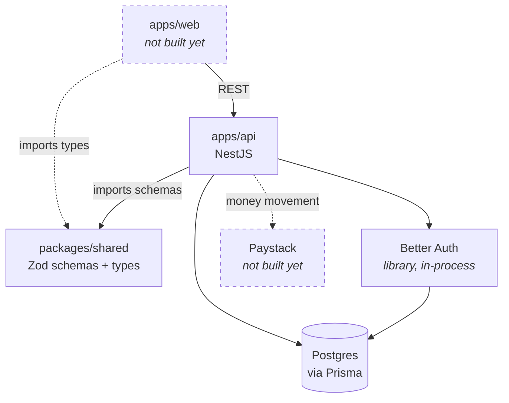
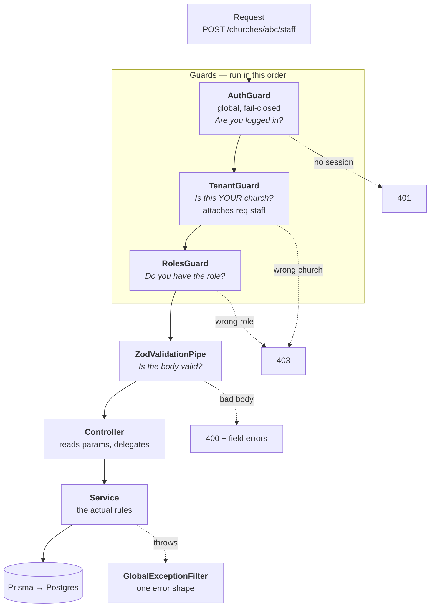
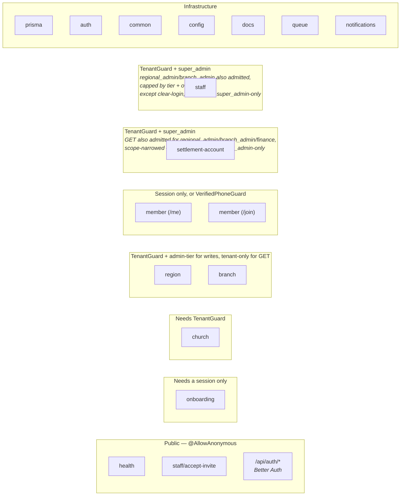
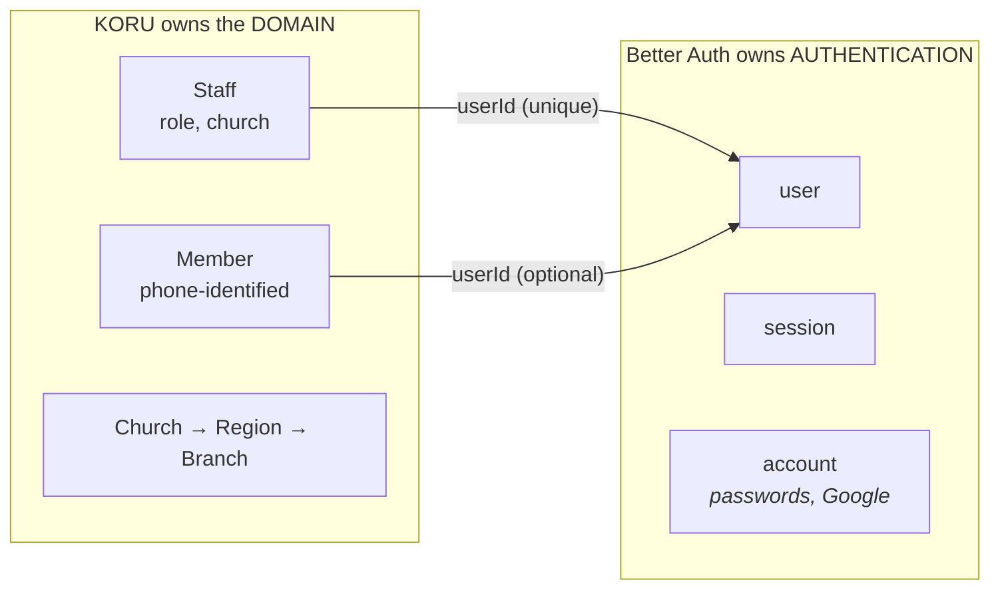

# KORU architecture

**This is the map of how the code actually works.** Start here if you are new, human or agent.

It is deliberately one document. Sibling documents exist only for flows too detailed to sit here, and they are all linked from [Feature flows](#feature-flows) below. See [Keeping this current](#keeping-this-current) at the bottom before you add anything.

Where this fits with the other docs:

| Document | Answers |
|---|---|
| **This file** | *How does the code work?* Structure, request flow, patterns. |
| [`CONTEXT-MAP.md`](../CONTEXT-MAP.md) → per-package `CONTEXT.md` | *What do the words mean?* Pure glossary, no implementation. |
| [`docs/adr/`](./adr/) and [`apps/api/docs/adr/`](../apps/api/docs/adr/) | *Why is it like this?* Decisions and their trade-offs. |
| [`docs/agents/`](./agents/) | *How do we work?* Branching, CI, issue tracking. |

---

## Local development

Everything the API needs locally runs through one compose file:

```bash
docker compose up -d
```

This brings up three services:

| Service | Port(s) | What it's for |
|---|---|---|
| `postgres` | `5432` | The database. `DATABASE_URL` in `apps/api/.env` points here. |
| `redis` | `6379` | Backs the BullMQ `email` queue (`REDIS_URL`) — required, not optional; every email send goes through it. |
| `mailpit` | `1025` (SMTP), `8025` (web UI) | Captures every email `SmtpMailSender` sends when `SMTP_HOST`/`SMTP_PORT` point here, so you can see the actual rendered HTML at [http://localhost:8025](http://localhost:8025) instead of reading raw markup off a console log. |

Copy `apps/api/.env.example` to `apps/api/.env` and fill in the required vars. `RESEND_API_KEY`/
`MAIL_FROM` and `SMTP_HOST`/`SMTP_PORT` are both optional pairs — set the Resend pair to send real
email, set the SMTP pair to send to Mailpit instead, or set neither to fall back to
`ConsoleMailSender` (logs to stdout, dev/test only). If both pairs are set, Resend wins. See
[Email queue and delivery logging](./architecture/email-queue-and-logging.md) for how a send
actually flows through the queue once it leaves `mail-sender.ts`.

`GET /health/redis` (alongside the existing `/health` and `/health/db`) confirms the app can reach
Redis — useful after a fresh `docker compose up` to check everything is actually wired before
chasing a real bug.

---

## The shape of the system



Two things worth noticing straight away.

**Better Auth is a library, not a service.** It runs inside our own process and writes to our own Postgres. There is no third party in the login path. That was a deliberate choice, recorded in [ADR-0009](../apps/api/docs/adr/0009-better-auth-over-workos-and-handrolled.md).

**`packages/shared` is the shared kernel.** Zod schemas live there once and are used for three different jobs: validating requests at runtime, generating TypeScript types, and producing the OpenAPI documentation. One definition, three uses, so they cannot drift apart ([ADR-0005](../apps/api/docs/adr/0005-zod-single-source-openapi.md)).

---

## How a request travels

This is the single most useful thing to understand. Every request to a church-scoped route goes through the same pipeline, and most of the security happens before your code runs at all.



### Guards run before pipes

This ordering causes real confusion, so it is worth stating plainly. A guard runs **before** the validation pipe. That means a guard can read the URL, the session and cookies, but it must never read the request body, because the body has not been validated yet.

It also explains a behaviour that looks like a bug and is not. If you send a malformed `:churchId`, you get a **403 from the guard**, not a 400 from `ParseUUIDPipe`, because the guard got there first and could not match the nonsense id to your church.

### The three guards

| Guard | File | What it does |
|---|---|---|
| `AuthGuard` | from `@thallesp/nestjs-better-auth` | Applied globally. Every route is protected **unless** it is marked `@AllowAnonymous()`. Fail-closed by default. |
| `TenantGuard` | [`src/auth/tenant.guard.ts`](../apps/api/src/auth/tenant.guard.ts) | Takes `session.user.id`, finds that person's `Staff` row, and checks its `churchId` matches the `:churchId` in the URL. Attaches the row to `req.staff`. |
| `RolesGuard` | [`src/auth/roles.guard.ts`](../apps/api/src/auth/roles.guard.ts) | Reads the `@StaffRoles(...)` list off the controller and compares it to `req.staff.role`. A route with **no** `@StaffRoles(...)` decorator admits any tenant-matched staff role — a deliberate open-read default, not an oversight. See [ADR-0013](../apps/api/docs/adr/0013-staff-role-capability-matrix.md) for which of the five roles belong on which side of that line. |

Two rules that have already caused bugs here, so they are worth committing to memory:

1. **Put guards on the controller class, not on individual methods.** Then every new route inherits protection automatically instead of relying on someone remembering.
2. **Register the guards in the module's `providers` array.** They inject `PrismaService`, so without registration NestJS cannot construct them and every request returns 500.

### Why 403 and 404 both exist

They come from different layers and mean different things:

- **403** comes from `TenantGuard`: you are asking about a church that is not yours.
- **404** comes from the service: you are in the right church, but that particular record is not in it.

So `PATCH /churches/{mine}/regions/{someone-elses}` gives 404, while `PATCH /churches/{someone-elses}/regions/{anything}` gives 403. Do not "unify" these. Recorded in [ADR-0011](../apps/api/docs/adr/0011-tenant-crossing-403-not-404.md).

---

## Module map



| Module | Routes | Protection |
|---|---|---|
| `health` | `GET /health`, `GET /health/db`, `GET /health/redis` | Public |
| `onboarding` | `POST /onboarding/church` | Session only — you have no church yet |
| `church` | `GET`/`PATCH /churches/:churchId` | Tenant; `PATCH` also needs super_admin |
| `region` | CRUD under `/churches/:churchId/regions` | Tenant; every mutation (`POST`/`PATCH`/`DELETE`) needs `super_admin`/`regional_admin`/`branch_admin` — `finance`/`recorder` read only; `GET` is [cursor-paginated](#paginated-lists-are-cursor-based-not-offset-based) and narrowed to the caller's own scope for every delegated role (`super_admin` sees the whole church); mutations are authority-checked against that same scope via `ScopeService.assertCanActOnScope` (see [below](#scoping-a-mutation-is-not-the-same-check-as-scoping-a-list)) |
| `branch` | Create/read/update under `/churches/:churchId/branches` | Tenant; every mutation (`POST`/`PATCH`) needs `super_admin`/`regional_admin`/`branch_admin` — `finance`/`recorder` read only; `GET` is [cursor-paginated](#paginated-lists-are-cursor-based-not-offset-based) and scope-narrowed the same way as `region`; mutations are authority-checked the same way, including both sides of a move between regions |
| `staff` | CRUD + invites under `/churches/:churchId/staff` | Tenant + super_admin; every route except clear-login is also open to `regional_admin`/`branch_admin`, capped by [delegated management](./architecture/delegated-staff-management.md); `GET` is [cursor-paginated](#paginated-lists-are-cursor-based-not-offset-based) |
| `staff` (accept) | `POST /invites/accept` | **Public** — the token is the credential |
| `settlement-account` | CRUD under `/churches/:churchId/settlement-accounts` | Tenant + super_admin, except `GET`, also open to `regional_admin`/`branch_admin`/`finance` (a deliberate, per-route exception to the class-level lock — see [`settlement-account.controller.spec.ts`](../apps/api/src/settlement-account/settlement-account.controller.spec.ts)); `GET` is [cursor-paginated](#paginated-lists-are-cursor-based-not-offset-based) and scope-narrowed (a delegated caller's own branch(es) plus any church-wide account) |
| `member` | `GET /me`, `GET /me/churches/:churchId/{pledges,payments}` | Session only — own giving, filtered by session `userId`, never a guard; all three lists are [cursor-paginated](#paginated-lists-are-cursor-based-not-offset-based) |
| `member` (join) | `GET /join/:churchId/branches`, `POST /join/:churchId` (201 create / 200 update) | Session; `POST` also needs a verified phone; `GET` is [cursor-paginated](#paginated-lists-are-cursor-based-not-offset-based) |

Infrastructure modules carry no routes of their own: `prisma` (database access), `auth` (Better Auth setup and our guards), `common` (validation pipe, error filter, shared DTOs), `config` (environment validation), `docs` (OpenAPI and Scalar), `queue` (the BullMQ connection and the `email` queue, registered `@Global()` the same way `prisma` is), `notifications` (`MailService` and `EmailProcessor`). `notifications` is the first background-job module in the codebase — see [Email queue and delivery logging](./architecture/email-queue-and-logging.md) for the full flow, retry/backoff behavior, and why a queue exists here at all.

---

## Patterns to follow

These are the conventions the codebase already holds itself to. Matching them matters more than personal preference, because a second way of doing an existing thing is itself a defect.

### Controllers stay thin

A controller reads parameters, hands off to a service, and returns. Business rules do not live there. If you find yourself writing an `if` about domain logic in a controller, it belongs in the service.

### Services own the rules and the error mapping

Services throw NestJS exceptions; the filter turns them into responses. In particular, a Prisma `P2002` (unique constraint violation) is always caught and rethrown as a `ConflictException` with a message that names the conflict:

```ts
catch (e) {
  if (e instanceof Prisma.PrismaClientKnownRequestError && e.code === 'P2002') {
    throw new ConflictException(`Region ${input.name} already exists in this church`);
  }
  throw e;
}
```

A raw Prisma error reaching the client is a leak.

### Every tenant-owned query is scoped

Use `findFirst({ where: { id, churchId } })`, never a bare `findUnique({ where: { id } })`, for anything a church owns. Any id arriving from the client is hostile until it has been checked against the caller's church. Where a service accepts an id in the body — a `regionId`, a `branchId` — verify it belongs to the church before using it, following the `assertBranchInChurch` pattern.

### One error shape everywhere

Success responses return the resource itself, with no wrapper. Every failure conforms to a single `ErrorResponseSchema`, produced by [`GlobalExceptionFilter`](../apps/api/src/common/global-exception.filter.ts). There is deliberately no `{ success, message, data }` envelope ([ADR-0006](../apps/api/docs/adr/0006-standard-error-shape-no-envelope.md)).

### Never serialize these

`passwordHash`, `paystackSubaccountCode`, full account numbers, and any Better Auth token. Use Prisma's `omit` or a `publicShape` constant, and assert their absence in tests.

### Paginated lists are cursor-based, not offset-based

`Staff`, `Region`, `Branch`, `SettlementAccount`, and `Member`'s `GET` (list) routes share one
cursor contract in `packages/shared/src/pagination.ts`: `{ items, totalCount, hasNextPage,
hasPreviousPage, startCursor, endCursor }`, with a `?cursor&direction&limit` query. Not offset
(`page`/`pageSize`): offset pagination makes Postgres skip `N` rows to reach a deep page, which
gets slower the further a client pages, and it isn't stable under concurrent inserts/deletes — real
concerns at KORU's target scale of a single tenant with 30,000+ members and 500+ branches.
`MemberService`'s four lists (`listBranches`, `myProfile`'s memberships, `myPledges`,
`myPayments`) moved onto this same contract in
[koru-app/koru#84](https://github.com/koru-app/koru/issues/84) — every list endpoint in the API is
now on the shared contract; an unpaginated list is a regression, not a known gap. See
[ADR-0006](../apps/api/docs/adr/0006-standard-error-shape-no-envelope.md)'s update.

The envelope math (cursor validation, `hasNextPage`/`hasPreviousPage`, the empty-page cursor
fallback) lives in exactly one place, `apps/api/src/common/cursor-pagination.ts`
(`assertValidDirection`/`assertCursorVisible`/`buildCursorPage`), used by every service — it is
deliberately not re-implemented per model. `RegionService.list`/`BranchService.list`/`SettlementAccountService.list`
(`apps/api/src/{region,branch,settlement-account}/*.service.ts`) are the reference for how
authorization scoping is pushed into the same `where` clause instead of filtering in application
code after an unbounded fetch, resolving a caller's region/branch scopes via
`ScopeService.coveredRegionIds`/`coveredBranchIds`. `MemberService`'s four lists need no such scope
— they are self-scoped to the caller's own `userId`, not to a StaffScope.

### Scoping a mutation is not the same check as scoping a list

`ScopeService.coveredRegionIds`/`coveredBranchIds` resolve a branch scope *up* to its containing
region — correct for **visibility** (a branch-scoped clerk may see the region their branch sits
in), and their own comment says so: "For visibility only: do not use for authority checks." Using
them to gate a mutation was exactly the bug in
[koru-app/koru#96](https://github.com/koru-app/koru/issues/96): `RegionService.update`/`.remove`
and `BranchService.update` checked only that a row belonged to the caller's *church*
(`findById(churchId, id)`), never that it belonged to the caller's *scope* within it — so a
`branch_admin` could rename or delete any region in the church.

The fix, and the pattern for any future mutation on a scoped resource: authority is
`ScopeService.assertCanActOnScope(caller, target)`, built on `scopeCovers` — the one-directional
check (a region scope reaches its branches; a branch scope never reaches back up to its own
region) that `StaffService.assertCanManageStaff` already used for staff mutations. Creating a
branch inside a region, and moving a branch between regions, both need authority over **every**
region touched — creation checks the destination, a move checks the branch's current region *and*
the destination — or a `regional_admin` could plant a branch in, steal a branch from, or fling a
branch into a region they do not control. `finance` was deliberately dropped from every structural
mutation (`POST`/`PATCH`/`DELETE`) on both controllers — seeing the org structure is a finance
concern (`list`), editing it is not.

### Money is always integer Kobo

Never a float, never an ambiguous "amount". This is [ADR-0003](./adr/0003-money-as-integer-kobo.md) and it is not negotiable. Money columns are `BigInt` in Postgres (for headroom beyond a 32-bit `Int`), which `JSON.stringify` cannot serialize — every service returning a money field converts it with `bigintToKobo` from `packages/shared` before it reaches a controller. Never invent a second conversion path.

---

## Identity: the two halves



Better Auth answers "who is logging in and how". KORU answers "what may they do, and where". The link between them is `Staff.userId`.

Three consequences worth knowing:

- **One login is staff at exactly one church.** `Staff.userId` is unique, and `TenantGuard` relies on it. Someone serving two churches needs two logins.
- **Dual identity works.** The same login can be pointed at by both a `Staff` row and a `Member` row, because `Member.userId` is separate and not unique. One person, two roles, one login.
- **A verified phone earns the right to join, not membership itself.** `POST /join/:churchId` creates or links a `Member` explicitly, per church. Verifying an OTP alone never touches the `Member` table — see [ADR-0004](./adr/0004-members-phone-identified-no-accounts.md).
- **We deliberately do not use Better Auth's organization plugin.** Our `Church → Region → Branch` plus `StaffScope` model is richer and already built. Recorded in [ADR-0010](../apps/api/docs/adr/0010-better-auth-boundary-and-identity.md).

A staff member with `userId` still empty is **pending**: they exist in the church, and they cannot authenticate. That is enforced structurally rather than by a check, because `TenantGuard` resolves the tenant *through* that link, and an empty link resolves to nothing.

---

## Documentation surfaces

The API documents itself in two places, and that split is intentional rather than an oversight.

| URL | Contains | Generated by |
|---|---|---|
| `/docs` | KORU's own routes | Our Zod schemas, rendered with Scalar |
| `/schema.json`, `/schema.yaml` | The same document, machine-readable | `SwaggerModule` with `ui: false` |
| `/api/auth/reference` | Better Auth's routes | Better Auth's own `openAPI()` plugin |

They are separate because Better Auth's routes never pass through our decorators, so they cannot appear in our document. Do not try to merge them; that would mean hand-maintaining a description of routes we do not own.

All of these are public and unauthenticated on purpose. They publish route and field names, not data.

---

## Testing

| Layer | Location | Needs a database | Run with |
|---|---|---|---|
| Unit | `src/**/*.spec.ts`, beside the code | No | `pnpm test:unit` |
| End-to-end | `apps/api/test/*.e2e-spec.ts` | Yes — real Postgres | `pnpm --filter @koru/api test:e2e` |

**A unit test must pass with Postgres stopped.** That is the line between the two layers; if a test needs a database, it is an end-to-end test.

Services, guards, pipes, filters and everything in `packages/shared` need a spec. **Controller specs assert security wiring** — that the guards and `@StaffRoles` are actually attached — rather than delegation to a mocked service, which would pass even with no guards at all. The e2e suite proves delegation for real, running against a real database with `truncateAll` between tests and authenticating through the `createAuthedChurch` helper.

The full standard, including the legitimate skips and the exemplars to copy, is in [`docs/agents/testing.md`](./agents/testing.md).

---

## Feature flows

Deep-dive documents for flows too involved to describe here:

- [Staff invitations](./architecture/staff-invitations.md) — how a super admin adds a colleague, how the token works, and what happens on re-use, re-issue and revoke.
- [Delegated staff management](./architecture/delegated-staff-management.md) — how `regional_admin` and `branch_admin` create, update, remove, and manage the invites of staff below their own tier, all confined to their own scope.
- [Email queue and delivery logging](./architecture/email-queue-and-logging.md) — how `MailService`/`EmailProcessor` send email through a durable BullMQ queue instead of inline, how retry/backoff and dead-lettering work, and how the three interchangeable senders (Resend/SMTP/Console) are chosen.

---

## Keeping this current

**This document must be updated in the same pull request as the code it describes.** A stale architecture document is worse than none, because people trust it.

Update this file when you:

- add or remove a module, controller, or route — update the [Module map](#module-map)
- change the guard chain, the error contract, or a cross-cutting pattern
- add a new external dependency or integration
- change how identity or tenancy works

Add a sibling document under `docs/architecture/` **only** when a single feature flow needs more than roughly a screen of explanation to be understood, as staff invitations does. Then link it from [Feature flows](#feature-flows).

Do not create a document per module. The point of this file is that one place answers "how does this system work", and a reader should not have to assemble that answer from twenty files.

When you write one, prefer a mermaid diagram over a paragraph for anything with a sequence or a branch. GitHub renders them, and a picture of a flow is understood far faster than prose describing it.
