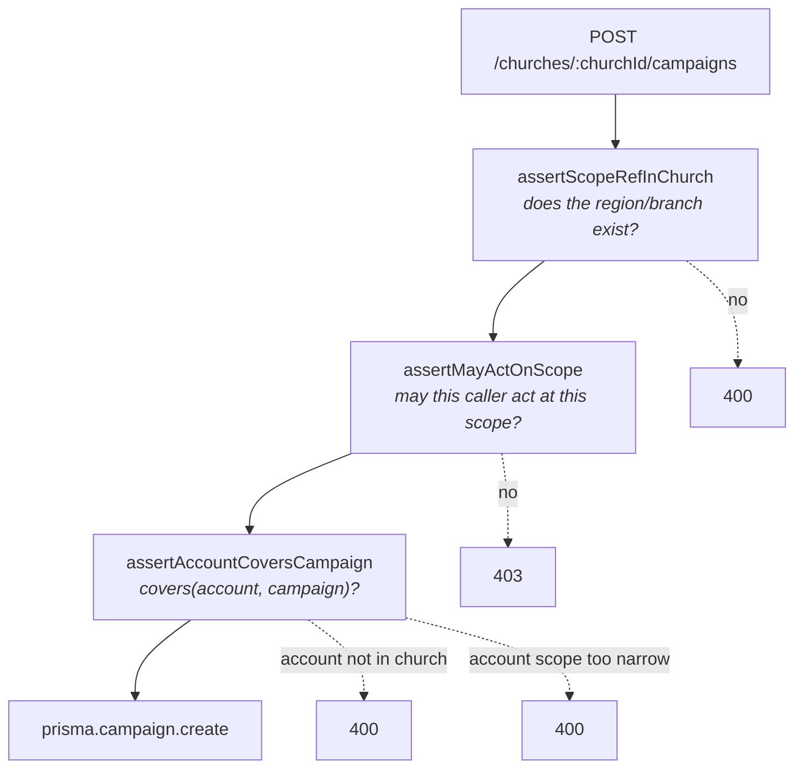
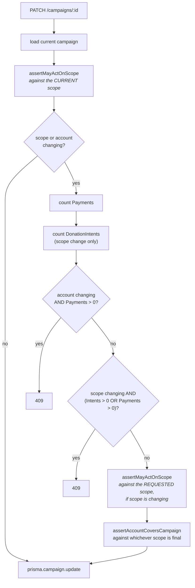

# Campaign scope and settlement routing

How a Campaign's scope decides which Settlement Account it may bank into, and why both lock once
giving exists.

Part of the [architecture map](../architecture.md).

The short version: `CampaignService.create` runs the same three checks in order every time — does
the requested scope actually exist in this church, does the caller have authority over it, and does
the chosen settlement account's own scope cover it. `update` runs the same three checks again when
scope or account is being changed, plus two lockouts that block the change outright once giving has
started. See [ADR-0021](../../apps/api/docs/adr/0021-campaign-settlement-routing-and-repoint-lockout.md)
for the reasoning behind each rule; this doc is the flow and the guard chain.

---

## The cast

| File | Its one job |
|---|---|
| [`campaign.service.ts`](../../apps/api/src/campaign/campaign.service.ts) | `create`/`list`/`findById`/`update`. Every authorization and compatibility check, run before the write. |
| [`campaign.controller.ts`](../../apps/api/src/campaign/campaign.controller.ts) | `POST`/`PATCH` carry `@StaffRoles` + `RolesGuard`; `GET` carries neither, open to any tenant-matched staff role, scope-narrowed inside the service. |
| [`scope.service.ts`](../../apps/api/src/auth/scope.service.ts) | `covers` (does one resource's scope contain another's — used here) and `scopeCovers` (does a caller's `StaffScope` grant authority — also used here, via `assertCanActOnScope`). |
| [`settlement-account.service.ts`](../../apps/api/src/settlement-account/settlement-account.service.ts) | Owns the account this doc's campaigns settle into, and the scope-mutation half of the orphan check below. |

## Create: three checks, in order



`assertMayActOnScope` is `CampaignService`'s own copy of the role-gate-plus-`ScopeService` pattern
`SettlementAccountService` already uses: a `CAMPAIGN_SCOPE_LEVEL_ROLES` lookup decides which roles
may act at each `ScopeLevel` (`church` stays `super_admin`-only, `region`/`branch` widen to
`regional_admin`/`branch_admin`/`finance`), then `ScopeService.assertCanActOnScope` checks the
caller's actual `StaffScope` for anything below `church`.

`assertAccountCoversCampaign` calls `ScopeService.covers(churchId, account, campaign)` — the account
is `outer`, the campaign is `inner`. A church-scoped account covers everything; a region-scoped
account covers itself and its branches; a branch-scoped account covers only itself. Reversing the
argument order inverts the rule into permitting the exact misroute it exists to stop — see
[ADR-0021](../../apps/api/docs/adr/0021-campaign-settlement-routing-and-repoint-lockout.md).

## Update: the same three checks, plus two lockouts

`update` only re-runs the create-time checks for whichever of `scopeType`/`scopeRefId` or
`settlementAccountId` is actually present in the request — a label-only rename does none of this.
Before either check runs, two independent counts decide whether the change is allowed at all:



The repoint lockout blocks on any `Payment`, not a pending `PaymentAttempt` — #107's Part 17.1
already made an in-flight attempt safe across a repoint by recording
`PaymentAttempt.settlementAccountId` at charge-creation time, so blocking on a pending attempt would
protect nothing new. The scope lockout is stricter: it blocks on either a `Payment` or a
`DonationIntent`, because a giver committing to a campaign's identity is itself a fact worth
protecting, before any money has actually moved.

## The read/write asymmetry, again

`GET` on this module carries no `@StaffRoles` — any tenant-matched staff role can list and read
campaigns, narrowed inside `CampaignService.scopeWhere` the same way `SettlementAccountService`
narrows its own list: `super_admin` sees everything, a delegated caller sees church-wide campaigns
plus whatever their own covered regions and branches contain. `POST`/`PATCH` carry the four
admin-tier roles at the method level, then `CampaignService` narrows further per scope level. This
is the same shape ADR-0020 already established for `SettlementAccount` — visibility is wide,
authority to change something is narrow — carried over rather than reinvented.

## Settlement-account scope mutation shares this module's shape

`SettlementAccountService.update` now accepts a scope change too (ADR-0021). It runs the mirror
image of this module's update lockout: instead of blocking the *campaign* from moving away from an
account, it blocks the *account* from moving away from a campaign that still needs it.
`assertCampaignsStillCovered` finds every `Campaign` currently settling into the account and checks
whether the requested new scope would still cover each one — expressed as one negated Prisma query,
not a loop over `covers`, so re-scoping an account costs one round trip regardless of how many
campaigns settle into it. It must stay equivalent to calling `covers(newScope, campaignScope)` for
each linked campaign — checked by hand against `covers`, not by a dedicated equivalence spec; see
[ADR-0021](../../apps/api/docs/adr/0021-campaign-settlement-routing-and-repoint-lockout.md) for the
edge case that check has to get right.

A third mutation path can break the same invariant: `BranchService.update` moving a branch to a
different region. `assertCampaignsStillCoveredAfterMove` is that module's mirror of the same check —
see ADR-0021 for why a branch move needed one too, and why all three checks re-verify inside the
write's own transaction rather than trusting an earlier count.

## The settlement attribution join — answering #141

Before this ticket, "how much did Branch X raise into Branch X's own bank account" had no answer in
the schema — only "how much did Branch X's members give, to anything, anywhere" was reachable,
because `branchId` on every money row is the *giver's* home branch, never the *settling* branch —
the ambiguity [#141](https://github.com/chuba-cn/koru/issues/141) exists to record.

The join that answers the real question exists without a new column:

```
Payment.paymentAttemptId → PaymentAttempt.settlementAccountId → SettlementAccount.scopeType/scopeRefId
```

Two caveats belong next to it. Both `Payment.paymentAttemptId` and `PaymentAttempt.settlementAccountId`
are nullable (`apps/api/prisma/schema.prisma`), so this join attributes **online giving only** — an
offline `Payment` (cash, POS, import — #110) has no `PaymentAttempt` and therefore no settlement
account to attribute to. And the repoint lockout above has a second-order benefit worth naming here:
because a campaign's account can no longer be repointed once a `Payment` exists, `Campaign.settlementAccountId`
is itself a reliable historical attribution for that campaign once giving has started — not merely
today's pointer, a claim about where every one of its `Payment` rows actually landed.
