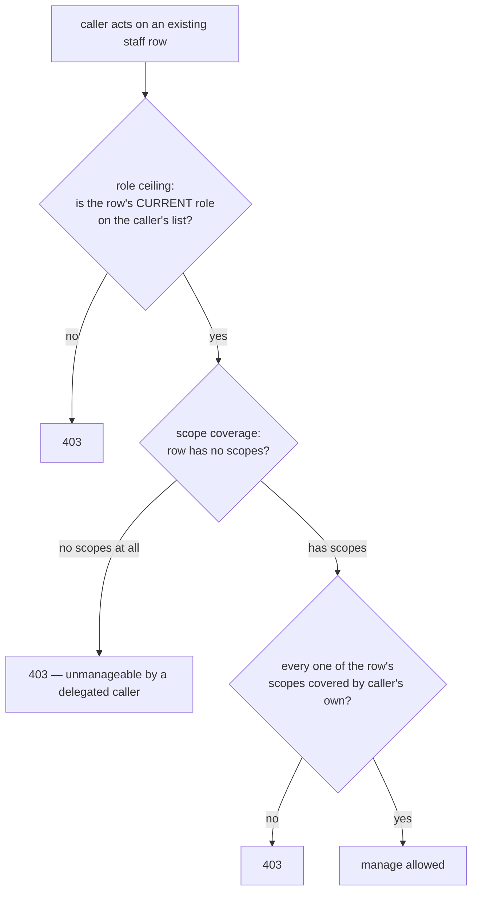
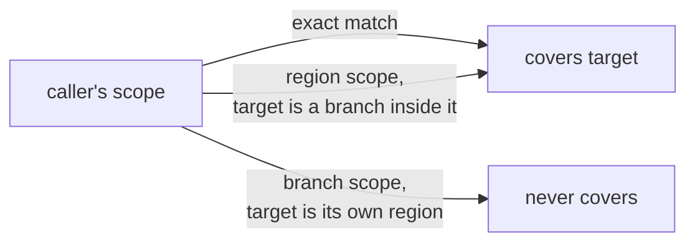

# Delegated staff management

How `regional_admin` and `branch_admin` create, update, remove, and manage the invites of staff
below their own tier — without a `super_admin` in the loop for every hire, rename, or revocation.

Part of the [architecture map](../architecture.md).

The short version: every staff route except **clear-login** (`POST :id/invite/clear-login`) is open
to `regional_admin`/`branch_admin`, not just `super_admin` — that includes `link-login`, which widens
the same way `reissueInvite` does, since it's a third route to the same outcome (onboarding someone
the caller already has authority over) that happens to apply when the invitee already has a login.
Two independent limits confine what a
delegated caller can do — **which roles**, and **which scope** — applied consistently whether
they're creating a new staff member or acting on one that already exists.

---

## Two questions, asked twice

The same two limits — role ceiling, scope coverage — answer two different questions depending on
the route:

| Question | Asked by | Checked against |
|---|---|---|
| "May I create *this*?" | `assertCanCreateStaff` | the role/scopes in the **request body** |
| "May I manage *that*?" | `assertCanManageStaff` / `canManageStaff` | the target staff row's **current** role/scopes |

`update`, `replaceScopes`, `reissueInvite`, `revokeInvite`, `remove`, `linkLogin`, and `list` all go
through the second question — a delegated caller's authority over an *existing* staff member depends on what
that staff member already is, not on who originally created them. Any `regional_admin` who covers a
recorder's branch can reissue that recorder's invite, whether or not they were the one who created
it.



`super_admin` skips this check entirely, same as creation — see
[`canManageStaff`](../../apps/api/src/staff/staff.service.ts).

A staff row with **zero scopes** (only reachable if a `super_admin` created it that way) is
deliberately unmanageable by any delegated caller — there is nothing for `scopeCovers` to check
against, so treating an empty scope list as "covers everything" would be a silent authority
widening. Only `super_admin` can act on a scope-less staff member.

---

## The two limits, for creation

`DELEGATED_ROLE_CEILING` in [`staff.service.ts`](../../apps/api/src/staff/staff.service.ts) is a
flat lookup: each admin-tier role maps to the list of roles it may create or manage, including
itself.

| Caller | May create / manage |
|---|---|
| `super_admin` | anything (not looked up in the table) |
| `regional_admin` | `regional_admin`, `branch_admin`, `finance`, `recorder` |
| `branch_admin` | `branch_admin`, `finance`, `recorder` |
| `finance`, `recorder` | nothing — not in the table, rejected before the ceiling is even checked |

A `regional_admin` creating another `regional_admin`, or a `branch_admin` creating another
`branch_admin`, is a deliberate **peer creation** — this is what lets a big church's regional
structure grow without waiting on `super_admin` for every branch-level hire.

The role ceiling alone would let a `regional_admin` create a `branch_admin` scoped to *any* branch
in the church, including one outside their own region. `ScopeService.scopeCovers` closes that: every
scope on the new staff record must be reachable from one of the caller's own scopes.



That last arrow is the one worth remembering: containment is **one-directional**. A region reaches
down into its branches, but a branch scope never reaches back up to its own region — otherwise a
`branch_admin` could claim region-level authority just by naming their region as a target scope.
See [`scope.service.ts`](../../apps/api/src/auth/scope.service.ts) and its spec for the full
containment rules.

A delegated creation with **no scope at all** is rejected outright — an admin-tier caller other than
`super_admin` must always name where the new hire's authority lives. And every scope named must
individually pass `scopeCovers`; if a request lists three scopes and the caller only covers two of
them, the whole creation is rejected.

---

## Reassigning a role has its own ceiling check

`update` has one more question beyond "may I manage this person" — if the request changes `role`,
the **new** role must also be within the caller's ceiling (`assertCanAssignRole`). A `branch_admin`
who manages a `recorder` may promote them to `finance` (still within ceiling), but not to
`regional_admin` — managing someone doesn't mean being able to hand them a role you could never have
created in the first place.

`replaceScopes` has the same shape for scopes: every *new* scope must pass `scopeCovers`
(`assertScopesGrantable`), and — like creation — a delegated caller may never reduce a staff member
to zero scopes. Orphaning someone's scope under delegated authority would leave them manageable by
nobody but `super_admin`, an unrecoverable state for a caller who didn't have `super_admin`'s reach
to begin with.

---

## `list` is filtered, not just gated

Unlike the other routes, `GET /staff` doesn't reject a delegated caller outright — it used to be
`super_admin`-only, and now returns a **filtered roster**: exactly the staff a `regional_admin`/
`branch_admin` could manage (same `canManageStaff` check, run per row). `super_admin` still sees
everyone.

This matters for a reason beyond convenience: without it, a delegated caller could be granted
`update`/`remove`/invite authority over people within their scope, yet have no way to discover those
people's ids through the API at all — a caller who can act but can't see is just as broken as one who
can see but can't act. Filtering `list` closes that gap, and also stops a `regional_admin` from
seeing another region's roster, which the unfiltered list would otherwise leak.

**Known tradeoff:** for a delegated caller, filtering runs `canManageStaff` per row, and each scope
on each row can cost a `scopeCovers` call (a `branch.findFirst` query, for a region-scoped caller
checking a branch-scoped row). A church with a large roster and heavily multi-scoped staff turns one
`GET /staff` into a proportional number of queries. Acceptable at today's scale — there is no
pagination on this endpoint at all yet — but the first place to look if this route gets slow as
rosters grow.

---

## Self-management is intended, not an oversight

A `regional_admin`/`branch_admin` can now act on their **own** staff row through every widened
route, including removing or demoting themselves — their own row trivially passes
`canManageStaff` (their own role is always on their own ceiling, their own scopes always cover
themselves). This is a straightforward consequence of the same rule applying uniformly to every
row a caller is authorized to touch, including their own, and mirrors how a `super_admin` could
already act on their own row before this change. It is not guarded against here; a church being
left without any `super_admin` is a separate, narrower guard tracked as its own ticket
(koru-app/koru#50), and a region/branch being left without any admin-tier staff at all is a wider
business-continuity question this ticket does not attempt to solve.

---

## Order of checks matters for the error the caller gets back

```ts
// staff.service.ts, StaffService.create
await this.assertChurchExists(churchId);
const scopes = input.scopes ?? [];
await this.assertScopesInChurch(churchId, scopes);   // do these scopes exist, in THIS church?
await this.assertCanCreateStaff(caller, input);       // does the caller have authority over them?
```

Existence is checked before authority, on purpose. A scope that does not exist, or belongs to
another church, is a **400** regardless of who is asking — it is a bad request, not a permissions
question. Only once the scopes are confirmed real and tenant-correct does the authorization check
run, so a caller who is refused always gets a **403** that means what it says: the scope was real,
and it just was not theirs to grant. `replaceScopes` follows the same order: `findById` (404 if the
staff doesn't exist), then `assertScopesInChurch` on the *new* scopes (400), then
`assertCanManageStaff` on the target's *current* row (403), then `assertScopesGrantable` on the new
scopes (403).

---

## What deliberately did not change

**`POST /staff/:id/invite/clear-login` stays `super_admin`-only.** This route deletes someone else's
Better Auth login outright — recovering from an unverified squatter having claimed a staff member's
email before they could accept their invite. That's a categorically more sensitive action than the
rest of staff management: irreversible, and reaching outside the tenant's own data into another
person's account. It already has its own reasoning in
[ADR-0012](../../apps/api/docs/adr/0012-unverified-email-reserves-nothing.md), unrelated to
role/scope delegation. `link-login` (attaching a **verified** existing login) is a materially
different, reversible action — setting a column, not deleting an account — which is exactly why it
widens to delegated admins while clear-login does not.

---

## Related decisions

- [ADR-0013](../../apps/api/docs/adr/0013-staff-role-capability-matrix.md) — the role capability
  matrix this feature is layered on top of, including its amendment for delegated management.
- [ADR-0012](../../apps/api/docs/adr/0012-unverified-email-reserves-nothing.md) — why clear-login
  stays `super_admin`-only, and why link-login doesn't have to.
- [Staff invitations](./staff-invitations.md) — what happens after a staff record is created,
  regardless of who created or now manages it.
