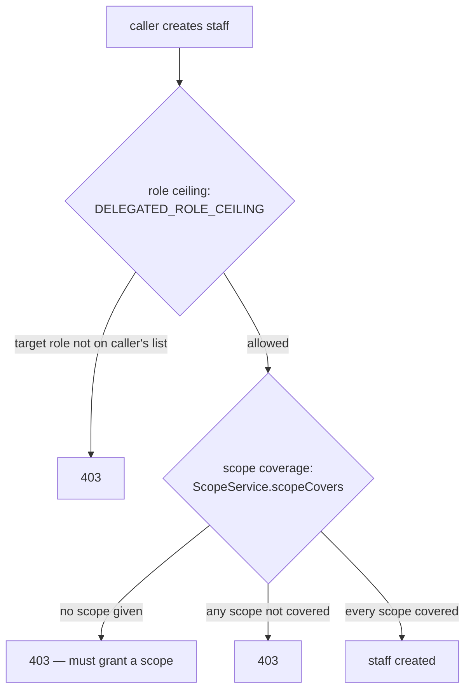
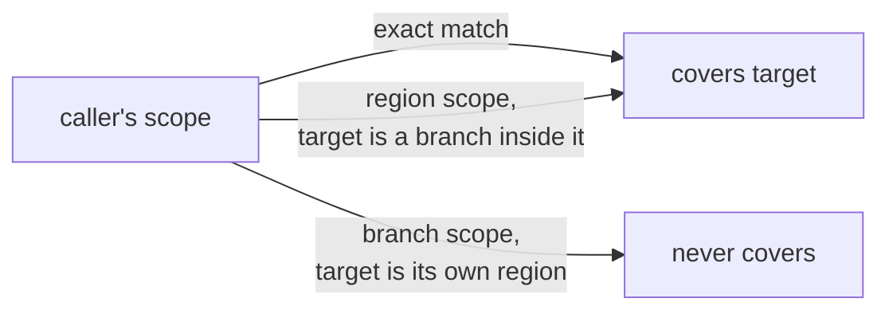

# Delegated staff onboarding

How `regional_admin` and `branch_admin` create staff below their own tier, without a `super_admin`
in the loop for every hire.

Part of the [architecture map](../architecture.md).

The short version: `POST /churches/:churchId/staff` is no longer `super_admin`-only. Every
admin-tier caller may create staff, but two independent limits confine what they can create —
**which roles**, and **which scope**.

---

## The two limits



`super_admin` skips both checks entirely — see [`assertCanCreateStaff`](../../apps/api/src/staff/staff.service.ts), which returns immediately for that role before either limit is evaluated.

### Limit 1 — the role ceiling

`DELEGATED_ROLE_CEILING` in [`staff.service.ts`](../../apps/api/src/staff/staff.service.ts) is a flat lookup: each admin-tier role maps to the list of roles it may create, including itself.

| Caller | May create |
|---|---|
| `super_admin` | anything (not looked up in the table) |
| `regional_admin` | `regional_admin`, `branch_admin`, `finance`, `recorder` |
| `branch_admin` | `branch_admin`, `finance`, `recorder` |
| `finance`, `recorder` | nothing — not in the table, rejected before the ceiling is even checked |

A `regional_admin` creating another `regional_admin`, or a `branch_admin` creating another
`branch_admin`, is a deliberate **peer creation** — this is what lets a big church's regional
structure grow without waiting on `super_admin` for every branch-level hire.

### Limit 2 — scope coverage

The role ceiling alone would let a `regional_admin` create a `branch_admin` scoped to *any* branch
in the church, including one outside their own region. `ScopeService.scopeCovers` closes that: every
scope on the new staff record must be reachable from one of the caller's own scopes.



That last arrow is the one worth remembering: containment is **one-directional**. A region reaches
down into its branches, but a branch scope never reaches back up to its own region — otherwise a
`branch_admin` could claim region-level authority just by naming their region as a target scope.
See [`scope.service.ts`](../../apps/api/src/auth/scope.service.ts) and its spec for the full
containment rules.

A delegated creation with **no scope at all** is rejected outright — an admin-tier caller other than
`super_admin` must always name where the new hire's authority lives. And every scope named must
individually pass `scopeCovers`; if a request lists three scopes and the caller only covers two of
them, the whole creation is rejected.

---

## Order of checks matters for the error the caller gets back

```ts
// staff.service.ts, StaffService.create
await this.assertChurchExists(churchId);
const scopes = input.scopes ?? [];
await this.assertScopesInChurch(churchId, scopes);   // do these scopes exist, in THIS church?
await this.assertCanCreateStaff(caller, input);       // does the caller have authority over them?
```

Existence is checked before authority, on purpose. A scope that does not exist, or belongs to
another church, is a **400** regardless of who is asking — it is a bad request, not a permissions
question. Only once the scopes are confirmed real and tenant-correct does the authorization check
run, so a caller who is refused always gets a **403** that means what it says: the scope was real,
and it just was not theirs to grant.

---

## Related decisions

- [ADR-0013](../../apps/api/docs/adr/0013-staff-role-capability-matrix.md) — the role capability
  matrix this feature is layered on top of, including its amendment for delegated onboarding.
- [Staff invitations](./staff-invitations.md) — what happens after a staff record is created,
  regardless of who created it.
