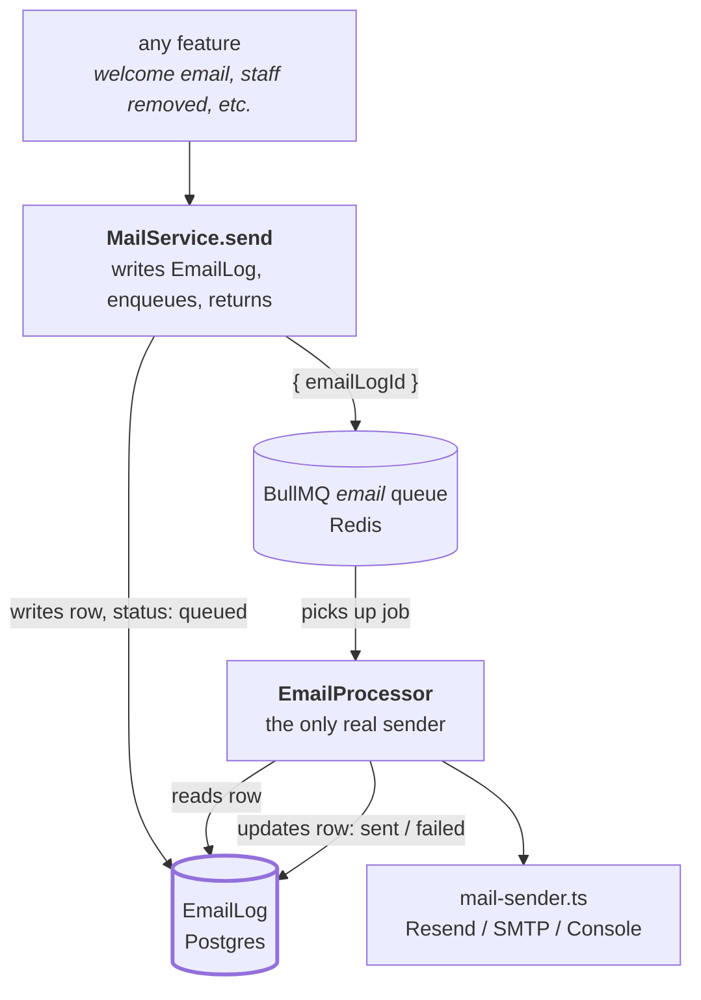
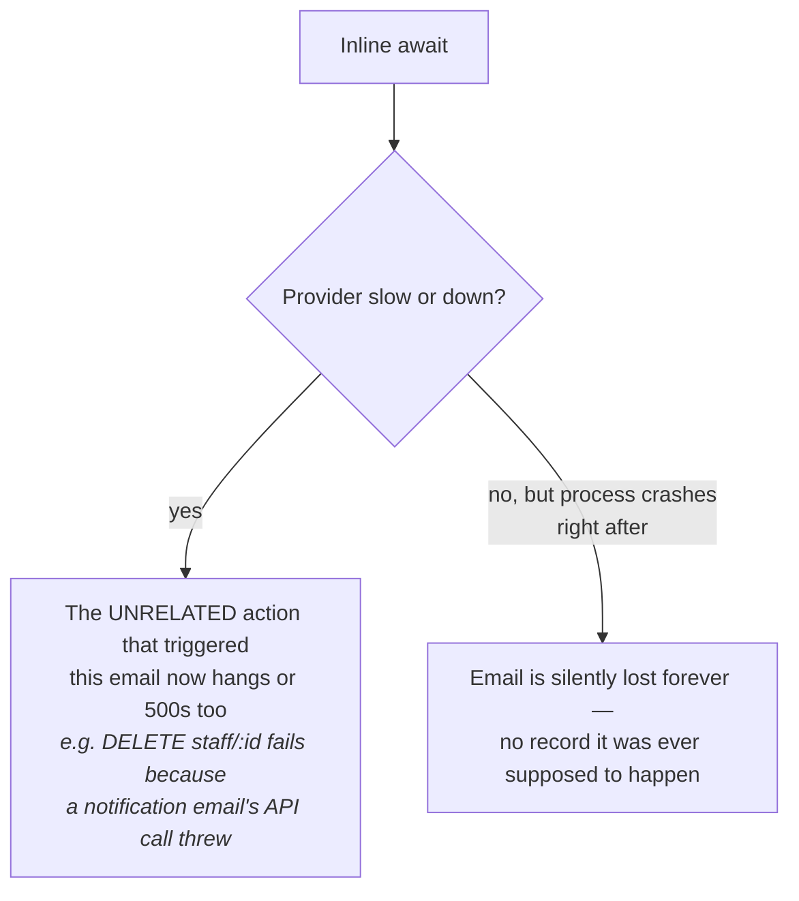
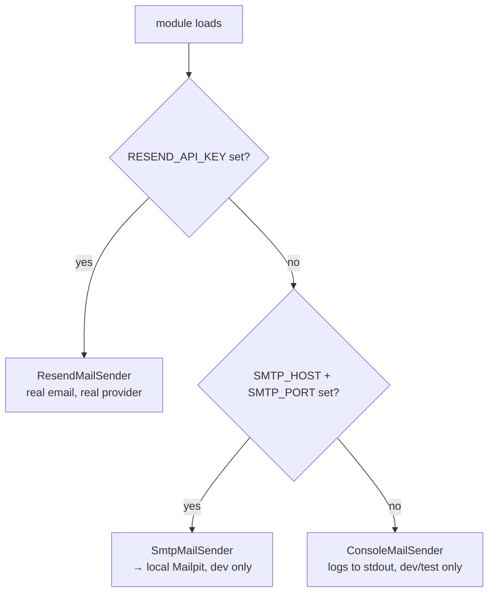
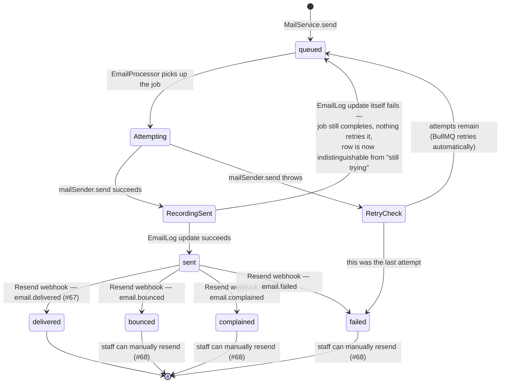

# Email queue and delivery logging

How KORU sends an email without a slow or down mail provider ever hanging or failing an unrelated
request, and how every attempt ends up in a durable, staff-visible record.

Part of the [architecture map](../architecture.md).

The short version: nothing calls a mail provider directly from a request. `MailService.send(...)`
writes an `EmailLog` row (`status: queued`) and hands a job carrying only that row's id to a BullMQ
queue, then returns immediately. A separate worker, `EmailProcessor`, is the only thing that ever
calls the real provider — it reads everything it needs from the row, sends, and updates the row's
status. The request that triggered the email never waits on any of that.

---

## The cast

| File | Its one job |
|---|---|
| [`mail-sender.ts`](../../apps/api/src/notifications/mail-sender.ts) | Three interchangeable ways to actually hand an email to a transport — Resend, local SMTP (Mailpit), or the console. Exactly one is live, chosen once at boot. |
| [`mail.service.ts`](../../apps/api/src/notifications/mail.service.ts) | The only thing any feature calls. Writes the log row, enqueues the job, never touches a mail provider itself. |
| [`email.processor.ts`](../../apps/api/src/notifications/email.processor.ts) | The worker. The only thing that calls `mailSender.send(...)` for real. |
| [`queue.module.ts`](../../apps/api/src/queue/queue.module.ts) | Wires the Redis connection and registers the `email` queue — no email-specific code lives here. |
| `EmailLog` (Prisma model) | The durable record. Every send KORU ever attempts has exactly one row. |
| [`resend-webhook.controller.ts`](../../apps/api/src/notifications/resend-webhook.controller.ts) / [`.service.ts`](../../apps/api/src/notifications/resend-webhook.service.ts) | Receives Resend's delivery-event callbacks and advances an `EmailLog` row past `sent` — the only way `delivered`/`bounced`/`complained` ever get set (#67). |
| [`email-log.controller.ts`](../../apps/api/src/notifications/email-log.controller.ts) / [`.service.ts`](../../apps/api/src/notifications/email-log.service.ts) | The staff-facing view: list a church's send history (scope-narrowed the same way as region/branch/settlement-account) and resend one that failed (#68). |
| [`@koru/emails`](../../packages/emails) | Every outbound template as a React Email component, plus the shared brand layout (logo, colors, support footer) they all render through (#79). |

`EmailLog` sits at the center on purpose. The job payload is deliberately just `{ emailLogId }` —
never the recipient, subject, or body — so Redis holds nothing tenant-sensitive even transiently.
The row is the single source of truth for both content and status; the queue only ever carries
"there is work to do."

---

## Why a queue, not an inline `await`

The obvious-looking alternative — call the mail provider directly inside `MailService.send`,
`await` it, done — has two failure modes that matter for a product handling real churches' money
and staff changes:

A queue backed by Redis closes the first failure mode outright, and narrows the second
considerably: the request returns as soon as the `EmailLog` row exists and the job is enqueued, and
once enqueued, the job survives a crash or redeploy because it's durable, not an in-memory promise.

**This is not fully atomic, and that residual gap is deliberate, not hidden.** `MailService.send`
does two separate writes — commit the `EmailLog` row to Postgres, then enqueue the job in Redis. A
crash in the narrow window between those two calls leaves a row permanently stuck at `status:
queued` with no job ever created for it — not "silently lost" in the sense of leaving no trace (the
row exists, and is visible to anyone querying `EmailLog` directly), but there is no automated
reconciliation sweep today that would notice a stuck row and re-enqueue it. Closing this fully would
mean either a transactional outbox (write the row and a "needs enqueuing" marker in one Postgres
transaction, have a separate process poll for markers) or accepting the gap as-is at this
volume/stage. See [ADR-0015](../../apps/api/docs/adr/0015-redis-bullmq-for-background-email-jobs.md)
for the full reasoning, including why this reverses an earlier "inline is fine" draft of the same
design.

---

## Choosing a sender

`mail-sender.ts` picks exactly one implementation, once, at module load — never per-request:

Resend wins if it's configured, regardless of whether SMTP vars also happen to be set. Both
`SmtpMailSender` and `ConsoleMailSender` refuse to run at all if `NODE_ENV === 'production'` —
production never falls back to a dev sender by accident; it fails loudly instead. See
[ADR-0014](../../apps/api/docs/adr/0014-resend-for-transactional-email.md) for the provider choice
itself.

Every sender returns the same shape: `Promise<string | undefined>` — the provider's own message id
when there is a real provider underneath (used to correlate a later delivery-status webhook back to
this exact `EmailLog` row), or `undefined` from `ConsoleMailSender`, which has no provider to
correlate against.

---

## What happens to a job: retry, backoff, and giving up

`sent` only means the provider *accepted* the email — it says nothing about what happened after. Everything past that point is Resend telling KORU, asynchronously, over its own webhook: delivered to the inbox, bounced, marked as spam, or failed outright. `EmailProcessor` (the queue worker) never sets any of these four statuses itself; `ResendWebhookService` is the only writer for all of them.

**A row at `queued` can now mean one of two different things, and nothing today tells them apart.**
Either it's genuinely still being attempted (retries remaining, or the job hasn't been picked up
yet), or the send already succeeded and the follow-up write that would have flipped it to `sent`
failed — in which case the job is done, BullMQ will never touch it again, and only #76's
reconciliation sweep (not yet built) can ever notice and correct it. This second path never reaches
`failed`, on purpose — see the "delivery vs. outcome persistence" reasoning below — but that means a
`queued` row is no longer proof that something is still in flight.

Defaults, set once in `QueueModule`, not repeated per-job: **5 attempts, exponential backoff at a
10s base** (10s / 20s / 40s / 80s between attempts — about 2.5 minutes total before giving up). Long
enough to ride out a short provider blip without a false `failed` showing up on a staff dashboard for
something that would have gone through seconds later; short enough that a genuinely down provider
surfaces as `failed` within the same support conversation, not an unbounded hang.

★ Insight ─────────────────────────────────────
`EmailProcessor`'s `catch` block runs on **every** failed attempt, not just the last one — BullMQ's
worker emits its failure event the same way regardless of whether a retry is coming. Marking the row
`failed` unconditionally there would be wrong: a transient first-attempt failure that BullMQ goes on
to retry successfully a few seconds later would already show as `failed` to a staff member watching
the dashboard. The `isFinalAttempt` check (`job.attemptsMade + 1 >= (job.opts.attempts ?? 1)`) is
what keeps the row `queued` through every attempt that still has retries left, and only flips it to
`failed` once every attempt is genuinely exhausted — verified directly against BullMQ's own source,
not assumed from its docs.
─────────────────────────────────────────────────

**BullMQ has no separate dead-letter queue.** An exhausted job just moves to BullMQ's internal
`failed` set and is eventually cleaned up (`removeOnFail: { count: 1000 }`). `EmailLog.status:
failed` *is* KORU's dead-letter signal — it's the only durable record that a send needs attention,
and the staff-facing resend action (#68, not yet built) is the only recovery path. There is no
automatic requeue of an exhausted job.

---

## When the enqueue itself fails

A rarer case: `emailQueue.add(...)` can throw on its own (Redis briefly unreachable), before BullMQ
even has a job to retry. `MailService.send` catches this specifically and marks the row `failed`
directly — this is the one place `MailService` swallows a failure synchronously rather than letting
the queue's own retry machinery handle it, because there is no job for BullMQ to retry at all. That
recovery write is itself wrapped in its own try/catch: if marking the row `failed` *also* fails (a
concurrent database blip), `MailService.send` still returns rather than throwing into the caller —
the one hard requirement this method has to meet, since callers include things like staff removal
that must never fail because a notification email had trouble.

---

## The health check

`GET /health/redis` exists because of a subtlety in how BullMQ exposes its connection:
`Queue.client` is a promise that resolves once, the first time the connection succeeds, and then
stays resolved for the rest of the process — awaiting it again later does not re-check anything.
Confirmed live: stop Redis after the app has been running, await `queue.client` again, it still
resolves. The health check instead calls `client.info()` after that, which is a real command
requiring an actual round-trip to Redis — the only way this endpoint can tell "connected once" from
"reachable right now."

---

## Delivery status past `sent`: the Resend webhook (#67)

`POST /webhooks/resend` is `@AllowAnonymous()` and excluded from Swagger — Resend calls it, not a
KORU user, and it carries no session. Trust comes entirely from a signature, not from being on the
network: Resend delivers its webhooks over Svix and signs every callback with
`RESEND_WEBHOOK_SECRET`; `ResendWebhookService` verifies that signature (via `resend`'s own
`webhooks.verify()`) before it does anything else — an invalid or missing signature is a `401`, and
nothing is read from or written to the database first. The signature lives in the `svix-id` /
`svix-timestamp` / `svix-signature` request headers, not the `webhook-*` names `resend`'s own
`verify()` options object happens to call them internally — confirmed against a real Resend webhook
delivery (#130), since every generic write-up of this API assumes the "webhook-*" names.

This is also why `AuthModule.forRoot` is configured with `bodyParser: { rawBody: true }`: signature
verification needs the exact bytes Resend signed, not a re-serialized `JSON.parse`'d body, which can
differ in whitespace or key order and would fail verification even for a genuine event.

Resend has 19 event types; only four are acted on (`email.delivered`, `email.bounced`,
`email.complained`, `email.failed` — see the state diagram above). Everything else — `email.opened`,
`domain.*`, `contact.*`, `suppressions.*`, and so on — is parsed successfully and acknowledged with
`200`, then dropped, deliberately. Rejecting an event type this receiver doesn't act on would be
wrong: Resend retries a webhook until it gets a `2xx`, so a closed schema or a hard failure on an
unmapped type would turn "we don't care about this one" into an endless retry loop.

The event's `data.email_id` is Resend's own provider-side message id, matched against
`EmailLog.providerMessageId` (set by `EmailProcessor` from `mailSender.send`'s return value). A
webhook for a message id with no matching row — the row predates this feature, or belongs to a
different KORU deployment sharing the same Resend account — is logged and acknowledged, never a
`500`.

## Staff-facing visibility and resend (#68)

`GET /churches/:churchId/email-logs` and `POST .../:id/resend` sit behind the same admin tier as
`settlement-account` (`super_admin`/`regional_admin`/`branch_admin`/`finance` — no `recorder`), and
the same scope-narrowing pattern as `region`/`branch`: a delegated caller sees a log if it's
church-wide (no staff or member recipient tied to it) or if the recipient's own scope falls within
the caller's covered branches; `super_admin` sees every row in the church.

Resend replays `EmailLog.renderedHtml` verbatim through `MailService.send` — it does not re-render
the template. That matters for the invite-email case in particular: the token embedded in an old
invite email is exactly the token a resend still delivers, not a freshly minted one. Only `failed`,
`bounced`, and `complained` rows are resendable; resending a `queued`, `sent`, or `delivered` row is
a `409`, and resending an id outside the caller's church or scope is a `404`, not a `403` — the same
"don't confirm existence" reasoning used everywhere else in this codebase.

## Related decisions

- [ADR-0014](../../apps/api/docs/adr/0014-resend-for-transactional-email.md) — why Resend, and why
  "Nigeria-first" doesn't drive this choice the way it does for SMS.
- [ADR-0015](../../apps/api/docs/adr/0015-redis-bullmq-for-background-email-jobs.md) — why a queue
  at all, and why it reverses an earlier "inline is fine" design.
- ADR-0002 (self-managed, no BaaS lock-in) — a managed Redis add-on in production is a pipe KORU
  talks to over the standard protocol, the same exception already carved out for Paystack and
  Resend, not a reopening of that rule.

## Auth emails (verification, password reset) never reach `EmailLog` at all

`auth.ts` loads outside Nest's DI container by design (see its own top-of-file comment), so it
cannot inject `MailService`, which needs both `@InjectQueue` and `PrismaService`. #59/#60 wire
`emailVerification.sendVerificationEmail` and `emailAndPassword.sendResetPassword` to call
`mailSender.send(...)` directly instead — the same precedent this file's own OTP sending already
set for `smsSender`.

One consequence worth being explicit about: these two email types get none of the durability this
whole system exists to provide. No `EmailLog` row, no retry on a transient provider failure, no
delivery tracking, no staff-visible record that a verification email was ever sent. That trade was
made deliberately — building a parallel raw-Queue-plus-Prisma path solely for two hook-driven email
types that `auth.ts` can't reach `MailService` from was judged not worth the duplication at this
stage — but it means a lost verification or reset email today has no resend button and leaves no
trace it ever tried to go out.

This is also why `EmailCategory` has no `auth_verification`/`auth_password_reset` values: a category
that can never produce a row would be dead schema. The retention/redaction question this section
used to raise (a live token sitting forever in a never-purged `renderedHtml` column) doesn't arise
either, for the same reason — there is no row.

## Deliberately not built

**A queue dashboard (Bull Board or similar).** Nice to have, not needed at this volume — the
staff-facing view of failures is `EmailLog`'s listing (#68), not a raw queue inspector, and that's a
deliberate choice: staff need to know "did Ada's welcome email go out," not "what's the state of the
BullMQ `email` queue."

**A second queue.** The `email` queue is deliberately the only one for now. A future job type (a
Nudge-epic SMS queue, say) should reuse this same `QueueModule`/Redis connection pattern rather than
stand up a second one — but that's that epic's own decision to make when it exists, not something
this system pre-authorizes.

**Automatic requeue of an exhausted job, or of a `bounced`/`complained` row.** Once a job reaches
`EmailLog.status: failed` (or the webhook marks it `bounced`/`complained`), nothing retries it
automatically. A human clicking resend (#68) is the only way back in — cheaper to build, and it
means a systemic provider outage, or a spam-complaint spike, doesn't quietly retry thousands of rows
the moment Resend recovers.

**A reconciliation sweep for webhook delivery, the same gap #67 shares with #76.** If Resend's
webhook call itself never arrives — its own outage, or the receiver being down for longer than
Resend retries — a row can sit at `sent` forever with no further status update and no automated way
to notice. Nothing today polls Resend's API to reconcile a stale `sent` row against the provider's
own record of what actually happened to it.
