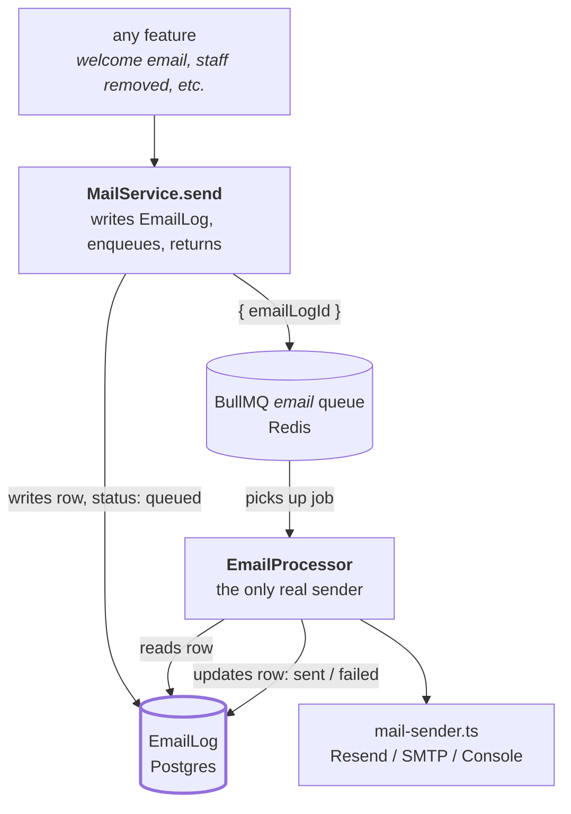
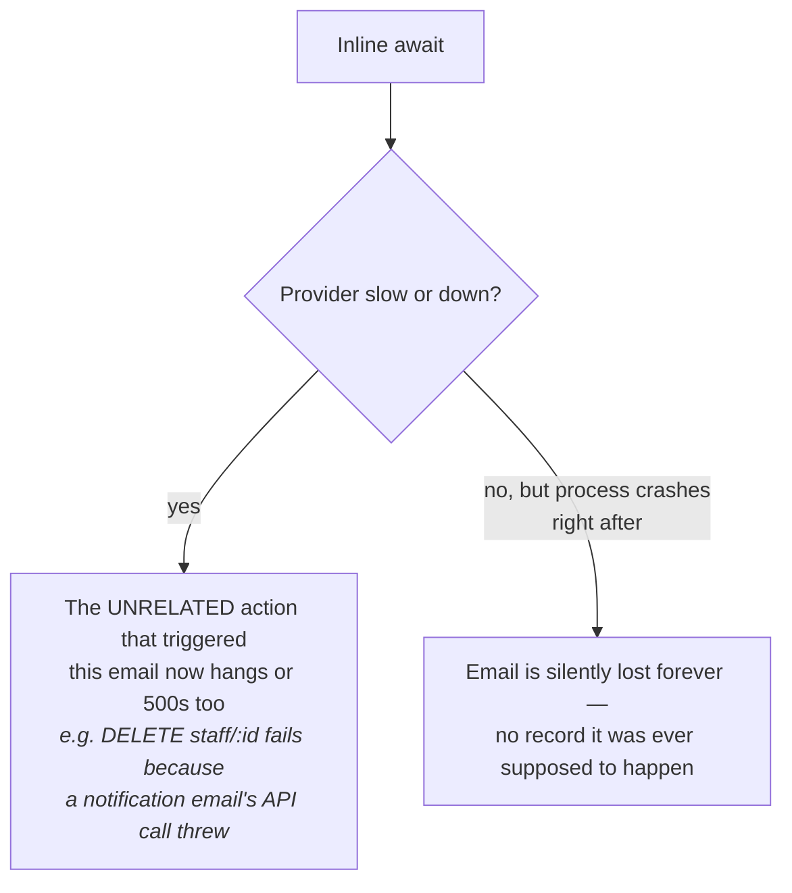
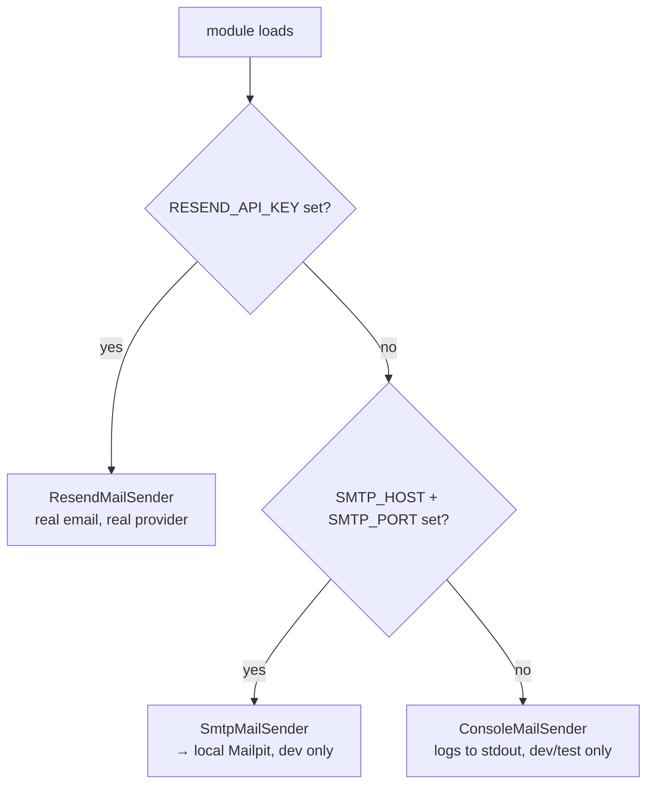
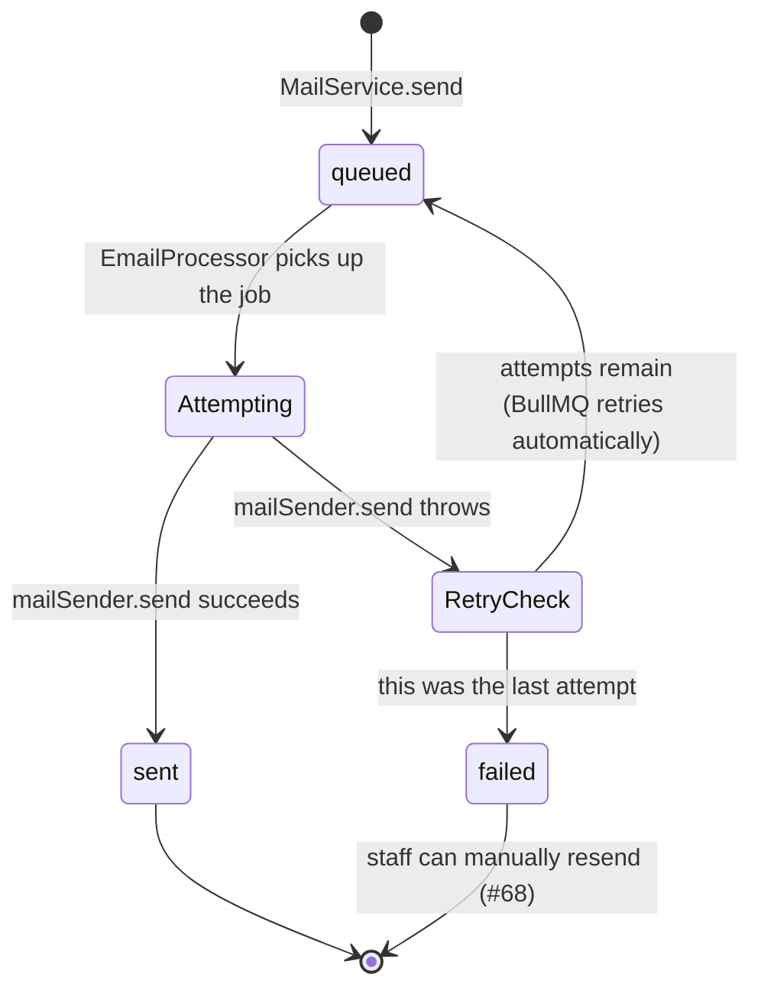

# Email queue and delivery logging

How KORU sends an email without a slow or down mail provider ever hanging or failing an unrelated
request, and how every attempt ends up in a durable, staff-visible record.

Part of the [architecture map](../architecture.md).

The short version: nothing calls a mail provider directly from a request. `MailService.send(...)`
writes an `EmailLog` row (`status: queued`) and hands a job carrying only that row's id to a BullMQ
queue, then returns immediately. A separate worker, `EmailProcessor`, is the only thing that ever
calls the real provider — it reads everything it needs from the row, sends, and updates the row's
status. The request that triggered the email never waits on any of that.

---

## The cast

| File | Its one job |
|---|---|
| [`mail-sender.ts`](../../apps/api/src/notifications/mail-sender.ts) | Three interchangeable ways to actually hand an email to a transport — Resend, local SMTP (Mailpit), or the console. Exactly one is live, chosen once at boot. |
| [`mail.service.ts`](../../apps/api/src/notifications/mail.service.ts) | The only thing any feature calls. Writes the log row, enqueues the job, never touches a mail provider itself. |
| [`email.processor.ts`](../../apps/api/src/notifications/email.processor.ts) | The worker. The only thing that calls `mailSender.send(...)` for real. |
| [`queue.module.ts`](../../apps/api/src/queue/queue.module.ts) | Wires the Redis connection and registers the `email` queue — no email-specific code lives here. |
| `EmailLog` (Prisma model) | The durable record. Every send KORU ever attempts has exactly one row. |

`EmailLog` sits at the center on purpose. The job payload is deliberately just `{ emailLogId }` —
never the recipient, subject, or body — so Redis holds nothing tenant-sensitive even transiently.
The row is the single source of truth for both content and status; the queue only ever carries
"there is work to do."

---

## Why a queue, not an inline `await`

The obvious-looking alternative — call the mail provider directly inside `MailService.send`,
`await` it, done — has two failure modes that matter for a product handling real churches' money
and staff changes:

A queue backed by Redis closes both: the request returns as soon as the `EmailLog` row exists and
the job is enqueued, and the job survives a crash or redeploy because it's durable, not an
in-memory promise. See [ADR-0015](../../apps/api/docs/adr/0015-redis-bullmq-for-background-email-jobs.md)
for the full reasoning, including why this reverses an earlier "inline is fine" draft of the same
design.

---

## Choosing a sender

`mail-sender.ts` picks exactly one implementation, once, at module load — never per-request:

Resend wins if it's configured, regardless of whether SMTP vars also happen to be set. Both
`SmtpMailSender` and `ConsoleMailSender` refuse to run at all if `NODE_ENV === 'production'` —
production never falls back to a dev sender by accident; it fails loudly instead. See
[ADR-0014](../../apps/api/docs/adr/0014-resend-for-transactional-email.md) for the provider choice
itself.

Every sender returns the same shape: `Promise<string | undefined>` — the provider's own message id
when there is a real provider underneath (used to correlate a later delivery-status webhook back to
this exact `EmailLog` row), or `undefined` from `ConsoleMailSender`, which has no provider to
correlate against.

---

## What happens to a job: retry, backoff, and giving up

Defaults, set once in `QueueModule`, not repeated per-job: **5 attempts, exponential backoff at a
10s base** (10s / 20s / 40s / 80s between attempts — about 2.5 minutes total before giving up). Long
enough to ride out a short provider blip without a false `failed` showing up on a staff dashboard for
something that would have gone through seconds later; short enough that a genuinely down provider
surfaces as `failed` within the same support conversation, not an unbounded hang.

★ Insight ─────────────────────────────────────
`EmailProcessor`'s `catch` block runs on **every** failed attempt, not just the last one — BullMQ's
worker emits its failure event the same way regardless of whether a retry is coming. Marking the row
`failed` unconditionally there would be wrong: a transient first-attempt failure that BullMQ goes on
to retry successfully a few seconds later would already show as `failed` to a staff member watching
the dashboard. The `isFinalAttempt` check (`job.attemptsMade + 1 >= (job.opts.attempts ?? 1)`) is
what keeps the row `queued` through every attempt that still has retries left, and only flips it to
`failed` once every attempt is genuinely exhausted — verified directly against BullMQ's own source,
not assumed from its docs.
─────────────────────────────────────────────────

**BullMQ has no separate dead-letter queue.** An exhausted job just moves to BullMQ's internal
`failed` set and is eventually cleaned up (`removeOnFail: { count: 1000 }`). `EmailLog.status:
failed` *is* KORU's dead-letter signal — it's the only durable record that a send needs attention,
and the staff-facing resend action (#68, not yet built) is the only recovery path. There is no
automatic requeue of an exhausted job.

---

## When the enqueue itself fails

A rarer case: `emailQueue.add(...)` can throw on its own (Redis briefly unreachable), before BullMQ
even has a job to retry. `MailService.send` catches this specifically and marks the row `failed`
directly — this is the one place `MailService` swallows a failure synchronously rather than letting
the queue's own retry machinery handle it, because there is no job for BullMQ to retry at all. That
recovery write is itself wrapped in its own try/catch: if marking the row `failed` *also* fails (a
concurrent database blip), `MailService.send` still returns rather than throwing into the caller —
the one hard requirement this method has to meet, since callers include things like staff removal
that must never fail because a notification email had trouble.

---

## The health check

`GET /health/redis` exists because of a subtlety in how BullMQ exposes its connection:
`Queue.client` is a promise that resolves once, the first time the connection succeeds, and then
stays resolved for the rest of the process — awaiting it again later does not re-check anything.
Confirmed live: stop Redis after the app has been running, await `queue.client` again, it still
resolves. The health check instead calls `client.info()` after that, which is a real command
requiring an actual round-trip to Redis — the only way this endpoint can tell "connected once" from
"reachable right now."

---

## Related decisions

- [ADR-0014](../../apps/api/docs/adr/0014-resend-for-transactional-email.md) — why Resend, and why
  "Nigeria-first" doesn't drive this choice the way it does for SMS.
- [ADR-0015](../../apps/api/docs/adr/0015-redis-bullmq-for-background-email-jobs.md) — why a queue
  at all, and why it reverses an earlier "inline is fine" design.
- ADR-0002 (self-managed, no BaaS lock-in) — a managed Redis add-on in production is a pipe KORU
  talks to over the standard protocol, the same exception already carved out for Paystack and
  Resend, not a reopening of that rule.

## Deliberately not built

**A queue dashboard (Bull Board or similar).** Nice to have, not needed at this volume — the
staff-facing view of failures is `EmailLog`'s listing (#68), not a raw queue inspector, and that's a
deliberate choice: staff need to know "did Ada's welcome email go out," not "what's the state of the
BullMQ `email` queue."

**A second queue.** The `email` queue is deliberately the only one for now. A future job type (a
Nudge-epic SMS queue, say) should reuse this same `QueueModule`/Redis connection pattern rather than
stand up a second one — but that's that epic's own decision to make when it exists, not something
this system pre-authorizes.

**Automatic requeue of an exhausted job.** Once a job reaches `EmailLog.status: failed`, nothing
retries it automatically ever again. A human clicking resend (#68) is the only way back in — cheaper
to build, and it means a systemic provider outage doesn't quietly retry thousands of dead jobs the
moment Resend comes back up.
