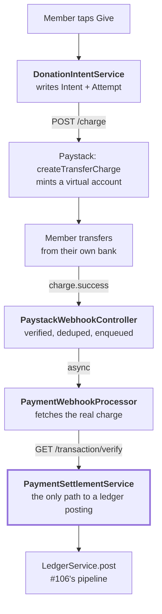

# Paystack Pay-with-Transfer giving

How a member's tap on "Give" becomes a real bank transfer, a verified charge, and a balanced
ledger posting — without any code outside `payments/gateway/` ever knowing Paystack exists.

Part of the [architecture map](../architecture.md).

The short version: `DonationIntentService` creates a `DonationIntent` and its first
`PaymentAttempt`, then calls `PaystackAdapter.createTransferCharge` to mint a one-time virtual
account. The member transfers into it. Paystack's webhook arrives, but its body is never trusted —
`PaymentWebhookProcessor` fetches the real charge and hands it to `PaymentSettlementService`,
which is the single path (shared with the future reconciliation sweep, #108) from provider data to
a `LedgerService.post` call. A separate sweep, `PaymentExpiryProcessor`, detects an unpaid virtual
account that expired, because Paystack sends no failure webhook for that case at all.

---

## The cast

| File | Its one job |
|---|---|
| [`payment-gateway.ts`](../../apps/api/src/payments/gateway/payment-gateway.ts) | The `PaymentGateway` interface and its capability flags (ADR-0019). Nothing outside `gateway/` may import `PaystackAdapter` concretely. |
| [`paystack.adapter.ts`](../../apps/api/src/payments/gateway/paystack.adapter.ts) | The only file that calls `api.paystack.co`. Charge creation, signature verification, webhook parsing, charge verification, bank directory, name-enquiry, subaccount creation. |
| [`donation-intent.service.ts`](../../apps/api/src/payments/donation-intent.service.ts) | Creates a `DonationIntent` + `PaymentAttempt` and calls the gateway to mint a virtual account. The idempotency boundary lives here. |
| [`donation.controller.ts`](../../apps/api/src/payments/donation.controller.ts) | `POST /me/churches/:churchId/donations` and `GET .../:id` — the member-facing routes this ticket adds. |
| [`paystack-webhook.controller.ts`](../../apps/api/src/payments/paystack-webhook.controller.ts) / [`.service.ts`](../../apps/api/src/payments/paystack-webhook.service.ts) | Verifies the signature, deduplicates into the `WebhookEvent` inbox, hands off to a queue. Public, no session. |
| [`payment-webhook.processor.ts`](../../apps/api/src/payments/payment-webhook.processor.ts) | The worker. Fetches the real charge and calls `PaymentSettlementService`. |
| [`payment-settlement.service.ts`](../../apps/api/src/payments/payment-settlement.service.ts) | The single path from provider data to a `LedgerService.post` call. Every check that keeps money honest lives here. |
| [`payment-expiry.processor.ts`](../../apps/api/src/payments/payment-expiry.processor.ts) | Detects and expires an unpaid `PaymentAttempt` past its virtual account's expiry — the only failure signal for this path, since Paystack sends none. |
| [`settlement-account.service.ts`](../../apps/api/src/settlement-account/settlement-account.service.ts) | Registers a Church's real bank account as a Paystack subaccount, Paystack-first. |

`PaymentSettlementService` sits at the center on purpose — see "Why one path, not two" below.

---

## Why Pay-with-Transfer, not Dedicated Virtual Accounts

ADR-0002 already made this call; it is restated here because an earlier draft of this ticket named
the wrong Paystack product. Dedicated Virtual Accounts (DVA) are **permanent, per-customer**, and
require an email plus identity fields — incompatible with KORU's phone-identified Members
(ADR-0004) and exactly the "account sprawl" ADR-0002 rejected. Pay-with-Transfer (PwT) is
**temporary, one-shot, amount-bound**, created per `PaymentAttempt` via a single `POST /charge`
call that carries our own `reference`, `metadata`, and `subaccount` for routing. Confirmed against
Paystack's live test API: the minimum charge is ₦100 (`MIN_DONATION_KOBO`), and the response shape
is exactly `{ reference, status: "pending_bank_transfer", account_name, account_number, bank, account_expires_at, amount }`.

## Why one path from provider data to a ledger posting, not two

`PaymentSettlementService.postCharge` is called from exactly one place today
(`PaymentWebhookProcessor`) but is written to be the single entry point a future reconciliation
sweep (#108) calls too. A webhook that arrives late and a sweep that independently discovers the
same charge must never disagree about what gets posted — putting the tenant checks, the amount
check, and the ledger call in one method makes that true by construction, the same reasoning
[the outbox doc](./transactional-outbox-and-relay.md) applies to `LedgerService.post` itself.

## The webhook is a trigger, not a fact

`PaystackWebhookService.receive` verifies the signature and persists the event — it never posts a
ledger entry. `PaymentWebhookProcessor` calls `gateway.fetchCharge(reference)` before doing
anything else, and `postCharge` reads **only** from that fetched result, never from the webhook
body. Two things forced this design, not just caution:

- Paystack's own `fees` field is inconsistently typed (sometimes a string, sometimes a number) —
  trusting the webhook body at all invites a class of bug the fetch sidesteps.
- The subaccount split can silently fail to apply, in which case the money never reaches the
  church's account at all. `postCharge` treats a missing or mismatched `subaccountCode` as a hard
  failure — **not** a pass — because a missing code is exactly the shape a failed split produces.

## Publish-then-verify, not verify-then-forget: why a non-`success` charge must throw

If `fetchCharge` reports anything other than `status: "success"` — most commonly because Paystack's
webhook fires slightly before its own `/transaction/verify` record catches up — `postCharge`
**throws**, rather than returning quietly. This is deliberate: a thrown error is what makes
BullMQ's retry curve on the `payment-webhooks` queue (8 attempts, exponential backoff) mean
something. Returning quietly would mark the job "processed" while the gift was never posted, with
no future attempt to notice.

## Expiry: the only failure signal Paystack doesn't send

Paystack's webhook catalog has no `charge.failed` for the bank-transfer channel — an abandoned
virtual account produces silence, forever. `PaymentExpiryProcessor.sweep()` is the only way an
unpaid attempt is ever noticed: a `FOR UPDATE SKIP LOCKED` claim (the same technique
[the relay uses](./transactional-outbox-and-relay.md#claim-enqueue-mark--and-why-that-order))
against `PaymentAttempt` rows whose `expiresAt` passed more than a 10-minute grace window ago. The
grace window exists because a transfer initiated in the account's last seconds can still land —
marking `expired` is not itself destructive (an `expired` attempt can still be settled later; see
below), but it is a state an operator reads as final, so the gap protects against a false read.

## `bank.transfer.rejected` and the late-transfer case

Two states `PaymentSettlementService` treats specially:

- **`bank.transfer.rejected`** — Paystack flags a wrong amount or a fraud signal. No money reached
  the gateway, so `recordTransferRejection` posts no ledger entry; it only marks the attempt
  `failed` with a reason.
- **An `expired` attempt that still settles** — a transfer initiated moments before expiry can
  still complete. `postCharge`'s status guard accepts `pending` and `expired` as valid starting
  states for settlement; only `succeeded` (idempotent no-op) and `failed` (hard refusal) are
  terminal.

## Registering a Settlement Account: Paystack-first, deliberately

`SettlementAccountService.create` calls Paystack (bank lookup, name-enquiry, subaccount creation)
**before** writing any row. The plaintext account number exists only in that request's memory —
only `accountNumberMasked` is ever persisted, so a row written before Paystack succeeded could
never be repaired without re-collecting the number from the church admin. Calling Paystack first
means a failure leaves nothing written at all; recovery is "submit the form again," needing no new
endpoint. The cost, stated plainly: a database failure *after* a Paystack success orphans a
subaccount at Paystack — inert, since no `Campaign` references it, logged with its code so an
operator can delete it by hand. No sweeper exists for this.

## Known, accepted gap: `POST /me/churches/:churchId/donations` has no rate limiting

#115 (Rate limiting & abuse protection) is not built. Every accepted request costs one real
Paystack `POST /charge`. Mitigations in place: a session is required, `VerifiedPhoneGuard` requires
a verified phone, the caller must already be a `Member` of the church, and
`MAX_PENDING_ATTEMPTS_PER_MEMBER` (5) caps how many attempts any one member can have in flight at
once — a cheap ceiling, not a substitute for #115's full framework. This is a deliberate,
time-boxed decision to unblock the member giving flow ahead of #115, which must land before any
real church is onboarded.

---

## Related decisions

- [ADR-0002](../../apps/api/docs/adr/0002-paystack-subaccounts-pay-with-transfer.md) — subaccounts
  and Pay-with-Transfer as the mechanism.
- [ADR-0016](../../apps/api/docs/adr/0016-double-entry-ledger-source-of-truth.md) — the ledger this
  whole flow ultimately writes to.
- [ADR-0017](../../apps/api/docs/adr/0017-donation-intent-payment-attempt-split.md) — why intent,
  attempt, and settled payment are three models, not one.
- [ADR-0019](../../apps/api/docs/adr/0019-payment-gateway-is-a-port.md) — the port this entire
  ticket implements: fetch-as-truth, derived dedupe keys, the provider dimension on the ledger.
- [Transactional outbox and relay](./transactional-outbox-and-relay.md) — the pipeline
  `LedgerService.post` hands every settled payment's event to.

## Deliberately not built

**Fee posting.** `ChargeFacts.feesKobo` is fetched and carried on every settled charge, but no
`fees` ledger entry is posted here — #108's own scope names "Record settlement payouts and
Paystack fees as their own ledger entries" as its job, and that is also the more accurate moment
to post them: the fee is realized when Paystack settles net, not when the charge merely clears.
Until #108 exists, `gateway_clearing` reads gross, not net — a known, stated gap, not an oversight.

**Reconciliation.** No polling of `GET /settlement`, no missed-webhook recovery, no comparison
against Paystack's own record of what it holds. `GET /health/payments` is the only visibility into
a stuck webhook or a backlog of past-expiry attempts until #108 lands.

**Refunds, disputes, chargebacks.** `PaymentGateway` deliberately has no `initiateRefund` method —
an unused, uncalled method that moves money is a liability. `capabilities.refunds`/`disputes` and
the frozen `RefundFacts` shape in `packages/shared` give #111 everything it needs to add the method
without reshaping the interface.

**Partial and overpayment handling.** Paystack's Pay-with-Transfer auto-rejects and auto-refunds a
wrong amount — a "partial payment" can only mean *multiple separate attempts* against one
`DonationIntent`, never a partial transfer into one account. `PaymentSettlementService` enforces
strict amount equality; any policy beyond that is #112's.

**Re-registering an existing Settlement Account with a different bank/account number.**
Structurally impossible without storing a plaintext account number, which this design deliberately
never does. A duplicate *registration* of the same bank account is now detectable, via a peppered
HMAC of the NUBAN stored as `accountNumberHash` and constrained unique per church, but the number
itself still never reaches the database.

**Any rule pairing a Campaign's scope with its Settlement Account's scope.** `CampaignScopeType` is
`church | region | branch`, but `SettlementAccount` today is only church-wide or branch-scoped, so a
region-wide campaign has no region-level account to point at. Nothing validates that a
branch-scoped campaign settles into that branch's own account, or that a church-wide campaign does
not settle into one branch's. That rule belongs to the campaign module, which does not exist yet.
What *is* guaranteed here: a Campaign cannot reference another church's Settlement Account at all,
because `Campaign.settlementAccount` is a composite foreign key on `(settlementAccountId, churchId)`,
so cross-tenant settlement is unrepresentable in the database rather than merely unimplemented.

**Guarding a Campaign against being repointed at a different Settlement Account mid-flight.**
Repointing is now *safe*: `PaymentAttempt.settlementAccountId` records the account each charge was
actually minted against, and `postCharge` compares the settled subaccount against that rather than
against whatever the campaign currently says. So an in-flight charge still settles correctly after a
repoint. What is not built is a rule making repointing *honest*, refusing it once settled Payments
exist, so a campaign's historical gifts stay explainable. That belongs with the campaign module too.

**A queue dashboard.** Same reasoning as the email queue and the outbox relay — `GET
/health/payments` is the staff-relevant signal, not a raw queue inspector.
