# Staff invitations

How a super admin adds a colleague to their church.

Part of the [architecture map](../architecture.md).

The short version: creating a staff member also mints a **single-use token** and, since #61, **sends
it by email** — the raw token still comes back in the API response too, and that response is the
documented fallback for a super admin to pass it on by hand when email isn't working. Accepting the
invite gives that person a real login and switches their staff record on.

---

## The cast

| File | Its one job |
|---|---|
| [`staff.controller.ts`](../../apps/api/src/staff/staff.controller.ts) | The front door for super admins and delegated admins. Checks who you are, then delegates. |
| [`staff.service.ts`](../../apps/api/src/staff/staff.service.ts) | Church rules. Creates the staff record, decides pending vs active, sends the invite email, and — since #62/#63 — resolves a collision with an existing login. |
| [`staff-invite.service.ts`](../../apps/api/src/staff/staff-invite.service.ts) | The token expert. Mints them, hashes them, decides if one is still good. |
| [`invite-email-template.ts`](../../apps/api/src/staff/invite-email-template.ts) | The one email template this module owns. |
| [`accept-invite.controller.ts`](../../apps/api/src/staff/accept-invite.controller.ts) | A separate **public** front door, for the invited person. |
| [`accept-invite.service.ts`](../../apps/api/src/staff/accept-invite.service.ts) | Turns an accepted invite into a real login. |

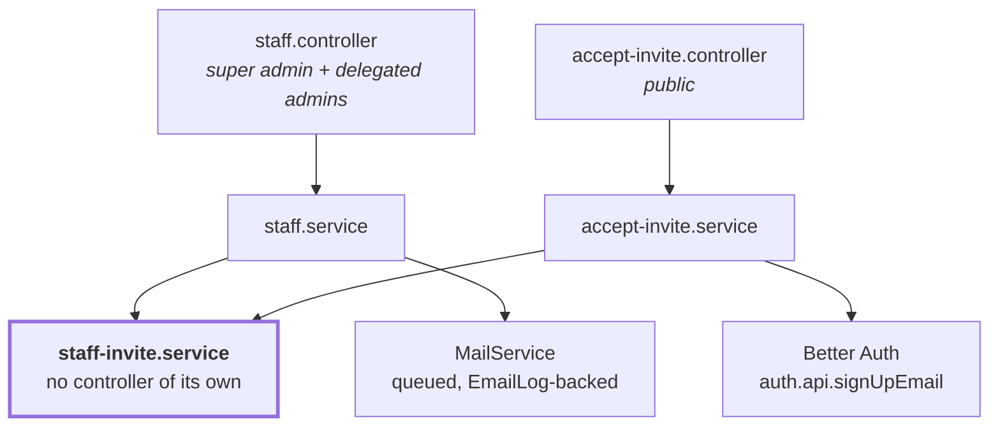

Note that **`staff-invite.service.ts` has no controller.** It never talks to the outside world directly. Both journeys reach it through another service, which is why all the token rules stay in one place.

**Why `staff.service.ts` uses `MailService`, not the direct `mailSender` singleton `auth.ts` uses for its own emails:** `StaffService` is an ordinary Nest provider inside the DI container, so it can inject `MailService` and get the durable, retried, `EmailLog`-audited send path — unlike `auth.ts`, which sits deliberately outside Nest's DI and has no choice but to call `mailSender` directly (see [`email-queue-and-logging.md`](email-queue-and-logging.md)). There is no architectural reason for this module to bypass the queue.

---

## Journey A: a super admin adds a colleague

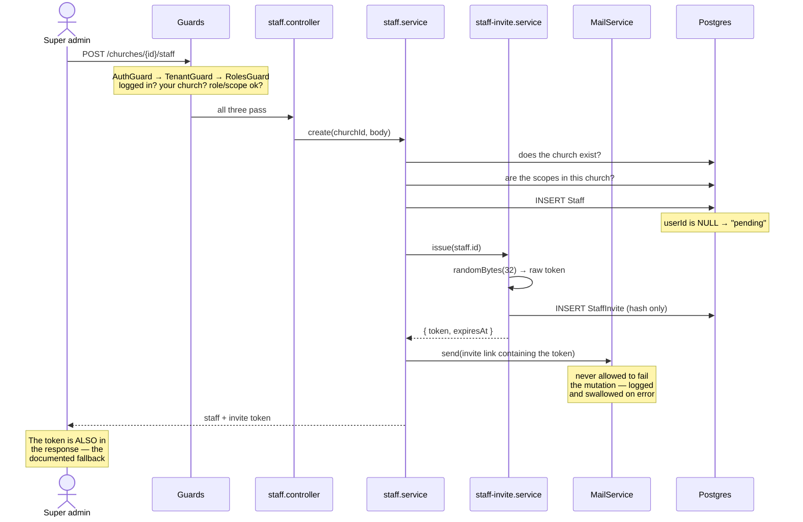

**Step by step, with the code:**

1. The guards run before any of our code, because they sit on the controller class at [`staff.controller.ts`](../../apps/api/src/staff/staff.controller.ts). That is why there is no permission check inside `create` itself — though `create` and every route that manages an *existing* staff member (`update`, `remove`, `reissueInvite`, `linkLogin`, and so on) also call `assertCanManageStaff`/`assertCanCreateStaff`, which check the caller's authority over *this specific target*, not just their role in general (see the [staff authority model](delegated-staff-management.md)).
2. `StaffService.create` checks the church exists and the scopes belong to it.
3. The `Staff` row is inserted with **`userId` left empty**. Nothing links this person to a login yet, and filling that gap is what the whole invite system exists to do.
4. `StaffInviteService.issue` mints the token and stores only its hash.
5. `StaffService` sends the invite email through `MailService`, containing a link with the raw token. If the send throws — a down provider, a database hiccup on the `EmailLog` write — it's caught, logged, and swallowed; the mutation that already succeeded is never rolled back for a reason as unrelated as a mail failure.
6. The raw token also comes back in the response, unconditionally, once. Email is the primary channel now; the response is the fallback for a member/staff address that doesn't work.

`reissueInvite` follows the same shape — mint a fresh token, send a fresh email, still return the token — for exactly the case email can't reach: a wrong number, a typo'd address, or someone who never got the first one.

### Where `status` comes from

`status` is **not stored in the database.** It is worked out fresh on every read, in `withStatus` at [`staff.service.ts:19-22`](../../apps/api/src/staff/staff.service.ts), by asking a single question:

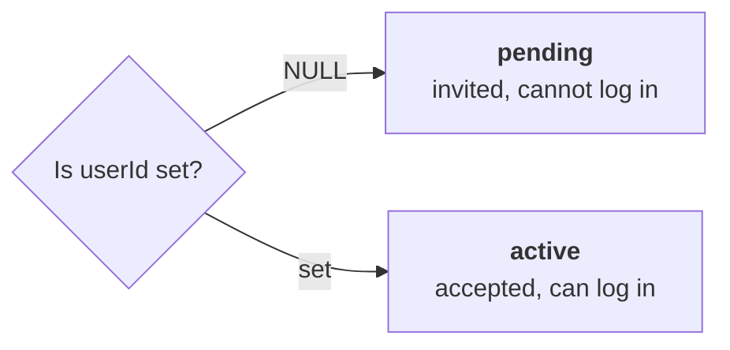

Because it is derived rather than stored, the status can never disagree with reality.

---

## How the token works

The token exists in two different forms, and only one of them is ever written down.

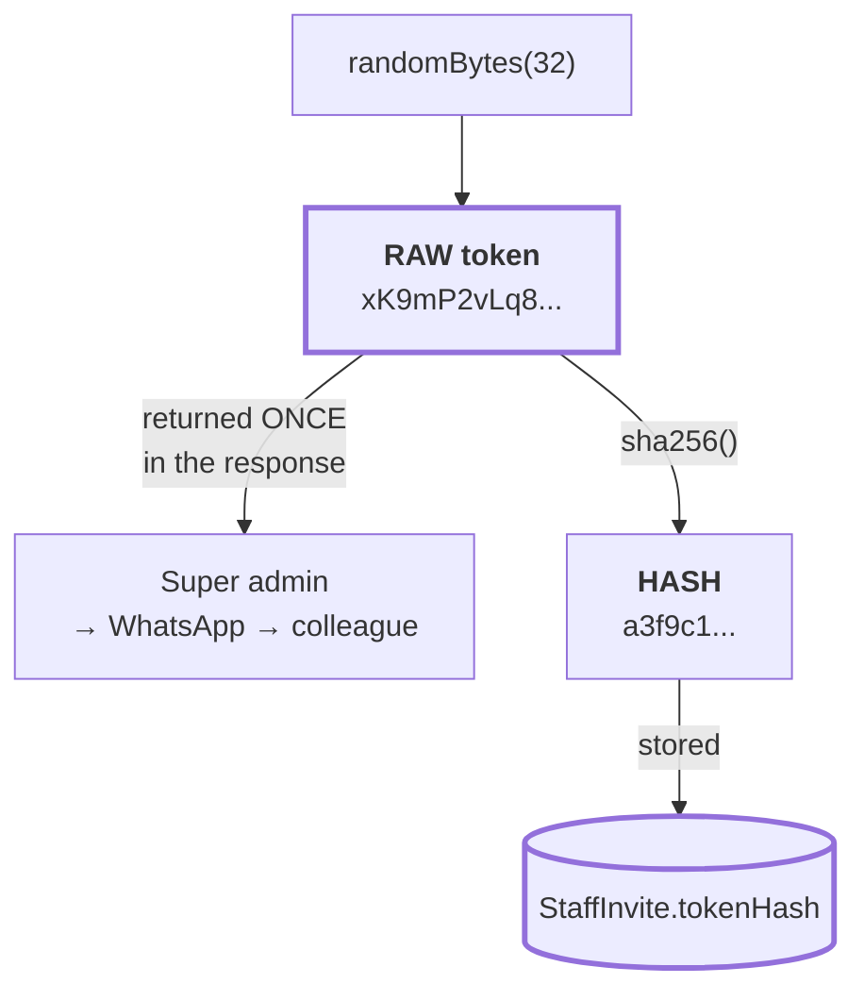

The raw token leaves the server exactly once. Open the `StaffInvite` table and you will find only a hash, which cannot be turned back into the token.

So how is it verified later, if the real thing was never stored? By hashing whatever arrives and looking for a row with that hash:

```ts
// staff-invite.service.ts:47-50
const invite = await this.prisma.staffInvite.findUnique({
  where: { tokenHash: this.hash(rawToken) },
  include: { staff: true },
});
```

A correct token hashes to the stored value and the row is found. A wrong one hashes to something else and the lookup returns nothing. **We never compare the secret ourselves**, which is why there is no string comparison anywhere in that file.

### Why SHA-256 and not bcrypt

For user passwords the answer would be the opposite, so this is worth understanding rather than copying.

Slow hashes like bcrypt exist to protect **low-entropy** secrets. A human password might carry 30 bits of entropy, so an attacker holding the hash can guess their way in, and bcrypt's job is to make each guess expensive.

This token carries **256 bits from a cryptographic random source**. There is nothing to guess. Bcrypt would add real cost to every acceptance and buy nothing. What we still need from SHA-256 is that it is one-way, so a leaked database hands over no usable tokens, and it gives us that.

---

## Journey B: the colleague accepts

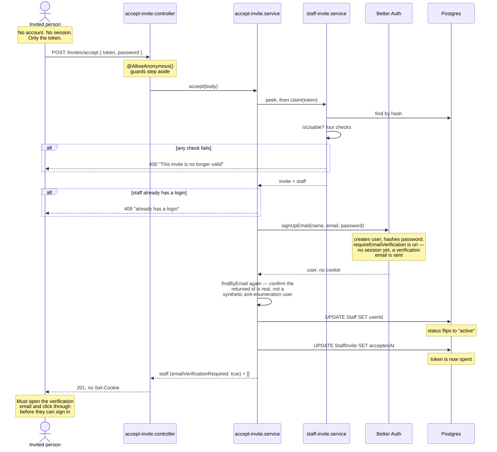

### Why this endpoint is public

Every other church route sits under `/churches/{churchId}/...` behind `TenantGuard`. That guard works by taking your session, finding your staff row, and checking it belongs to the church in the URL.

But this person has **no session and no staff link** — obtaining them is the entire point of accepting. Behind the guard, they would need to already be what the invite is trying to make them. So the route lives at the top level and is marked `@AllowAnonymous()` at [`accept-invite.controller.ts:17`](../../apps/api/src/staff/accept-invite.controller.ts).

**The token is the credential here**, which is exactly what an invite is.

### Why Better Auth creates the login — and why it no longer logs you in

[`accept-invite.service.ts:20`](../../apps/api/src/staff/accept-invite.service.ts) hands the password to `auth.api.signUpEmail` rather than hashing it ourselves. Password hashing and session creation are precisely what we adopted Better Auth to avoid hand-rolling ([ADR-0009](../../apps/api/docs/adr/0009-better-auth-over-workos-and-handrolled.md)).

`asResponse: true` still hands back a full HTTP response — but since #59, `AcceptInviteService` no longer forwards whatever `getSetCookie()` returns; it hardcodes an empty cookie list instead, so accepting an invite can never leak a session even if Better Auth's own cookie behavior changes later. Setting `emailAndPassword.requireEmailVerification: true` makes Better Auth skip auto-sign-in for **every email/password sign-up**, not only this one (`shouldSkipAutoSignIn`, `dist/api/routes/sign-up.mjs`) — this doesn't touch Google sign-in, which is governed by the separate `socialProviders` config — so the invitee now has to open the verification email Better Auth sends on their behalf and follow its link before `/api/auth/sign-in/email` will accept their new password at all.

**A second, unrelated effect of the same flag matters here too.** Before #59, a sign-up against an email that already had a login threw `USER_ALREADY_EXISTS_USE_ANOTHER_EMAIL`, which the old post-call `emailTaken` regex fallback caught. `requireEmailVerification: true` changes that: Better Auth now returns `200` with a fabricated, never-persisted user object instead — an anti-enumeration measure that also defeats that fallback for the raced case. `AcceptInviteService.accept` closes this by calling `authUsers.findByEmail` a second time after the "successful" sign-up and rejecting with the same `EMAIL_TAKEN_MESSAGE` if the id doesn't match a real, persisted user.

---

## When the email is already taken

Anyone can create a login holding a staff member's email before that person accepts — self-serve
church founding and member sign-up are both public. Before #59, an unverified email proved nothing
about who controlled it, so the only defensible recovery was reclaim: an authenticated super_admin
deleting a login that owned nothing, after a grace period protecting a bystander mid-signup. **#59
made `emailVerified` a real, checkable fact, and that changes which recovery is actually correct** —
reclaim (ADR-0012) is retired, replaced by two routes that ask a different question first: is the
colliding login *proven*, or not?

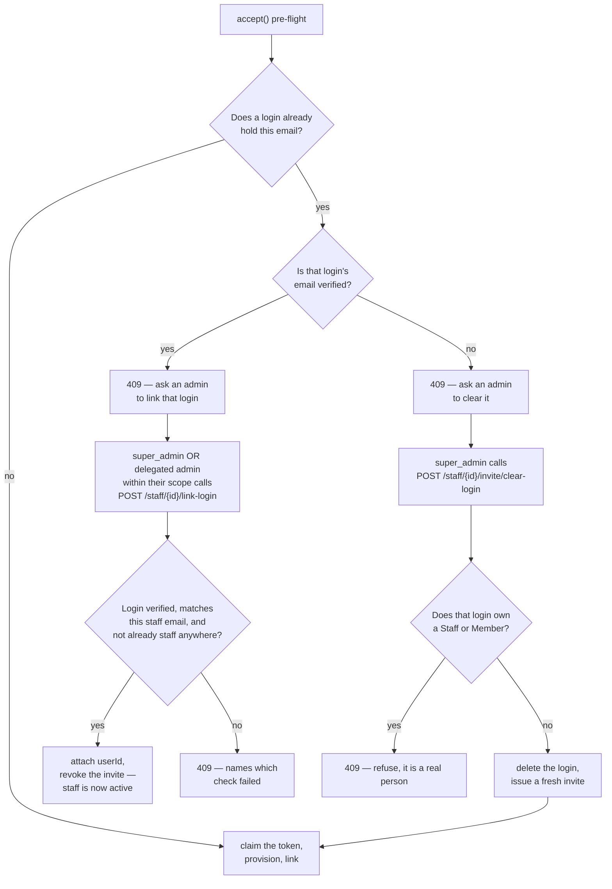

**Linking (`POST /staff/{id}/link-login`, #63) — for a proven collision.** A verified login is a real
person who controls that inbox; attaching it is the tenant vouching for an identity it can actually
check, the same trust substitution reclaim always relied on, just now grounded in a fact instead of
an assumption. Guarded by: the staff record must still be pending, the requested email must match it
case-insensitively (the same normalization Better Auth itself applies), a login must exist for that
email and be verified, and that login must not already be staff
anywhere (`Staff.userId` is `@unique` — a concurrent double-link is caught by the database itself, not
just a pre-check). Open to the same roles that can create or re-issue an invite for this staff member
— a `regional_admin` who could onboard someone by invite can equally onboard them by linking; only
`clear-login` below stays super_admin-only.

**Clearing (`POST /staff/{id}/invite/clear-login`, #62) — for an unproven one.** An unverified login
is still, by ADR-0012's original reasoning, not provably anyone — deleting it and re-inviting is
correct. What changed from reclaim: the one-hour grace period is gone, because `emailVerified` now
answers the question the grace period could only approximate. It cannot own a Staff or Member row
through any normal signup path once verification gates sign-in, but the check that it owns nothing
stays load-bearing regardless — the phone-number OTP path can still create an unverified login that
owns real data (a synthetic `@members.koru.invalid` email, never a real staff address, but the guard
doesn't assume that and checks directly). This route stays super_admin-only: deleting another
person's Better Auth account, even an unverified one, is irreversible and reaches outside the
tenant's own data.

**Linking is never available for an unverified login, at either route.** That's ADR-0012's core rule,
unchanged: a matching-but-unverified address proves nothing, so linking it would still be privilege
escalation, whether attempted through the public accept path or through an authenticated admin route.
See [ADR-0012](../../apps/api/docs/adr/0012-unverified-email-reserves-nothing.md), amended for #62/#63
with the reasoning above and a historical record of what reclaim used to do.

## The gatekeeper: one function, four questions

The same four rules decide every rejection, and they are encoded twice in [`staff-invite.service.ts`](../../apps/api/src/staff/staff-invite.service.ts): once in `isUsable`, which the read-only `peek` uses, and once in the `where` clause of `claim`'s conditional `UPDATE`. Those two must stay in step.

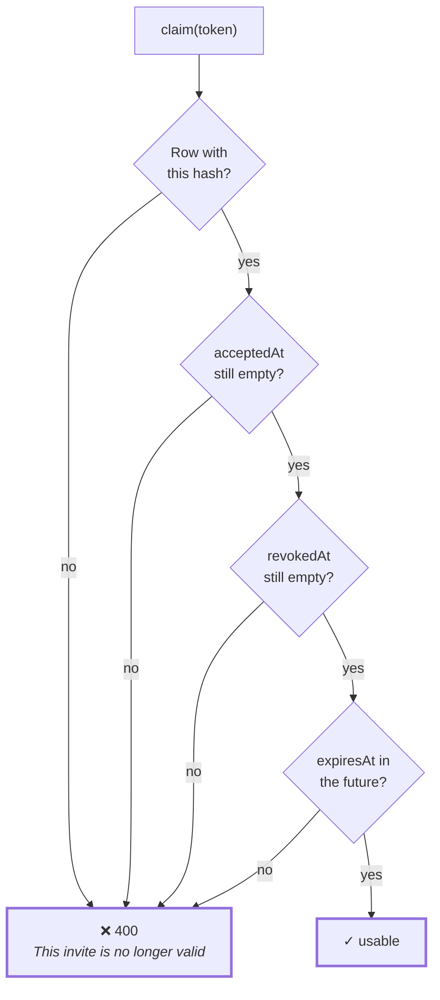

Keeping all four in one place matters. Spread across the accept path, the re-issue path and the revoke path, one of the three would eventually be updated and the others forgotten.

**Every failure returns the same message.** Saying "this invite expired" would confirm to a stranger that the token they guessed was real. Saying the same thing in all four cases gives nothing away.

---

## The four scenarios

### Accepting twice

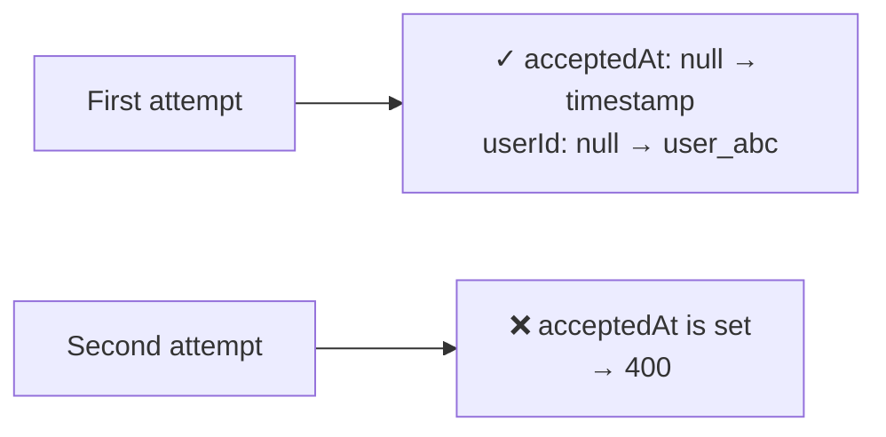

This is what makes the token single-use, and it matters because invites travel over WhatsApp, and WhatsApp messages get forwarded. Once the real person accepts, that message is worthless to anyone else.

Single-use is enforced by the claim itself: one conditional `UPDATE` that sets `acceptedAt` only while it is still null. Two concurrent accepts cannot both win, because the loser blocks on the row lock and then matches nothing. A separate check that the staff member has no login yet runs before the claim, so a burnt token only ever means a genuine fault.

### Re-issuing

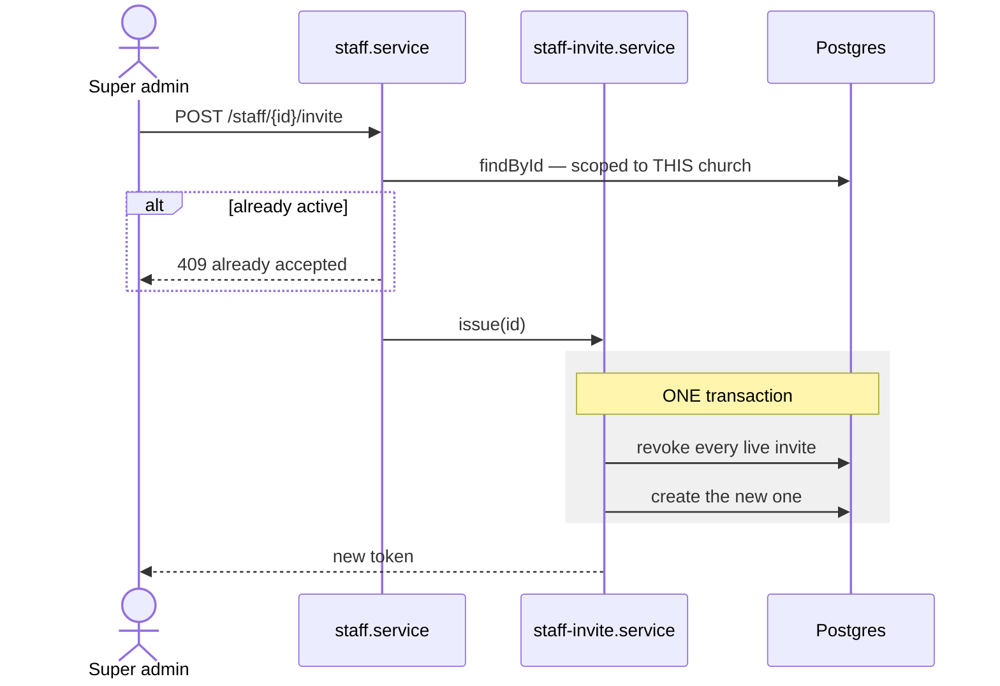

The transaction at [`staff-invite.service.ts:25`](../../apps/api/src/staff/staff-invite.service.ts) is the interesting part. Both statements succeed together or neither happens. If the revoke worked and the create failed, the person would be left with no usable invite and no clue why.

The ordering means **the old token dies the instant a new one is issued**. So if an invite goes to the wrong number, the fix is simply to re-issue.

The `findById` call is doing quiet security work: it scopes the lookup to the church in the URL, so a super admin of one church cannot re-issue invites for another church's staff.

### Revoking

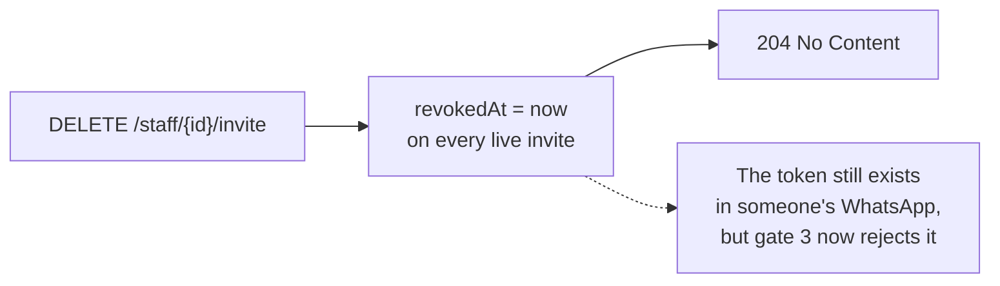

The staff record survives. The person stays in the list as `pending` with no working way in. To remove them entirely, use `DELETE /staff/{id}` instead.

### Expiring

Nobody does anything. One week after it was created, `expiresAt` slips into the past and the fourth gate starts rejecting it.

There is **no cleanup job** deleting old rows, on purpose. When someone asks "why can't Ada log in?", the table answers it: accepted, revoked, or expired.

---

## The whole thing on one page

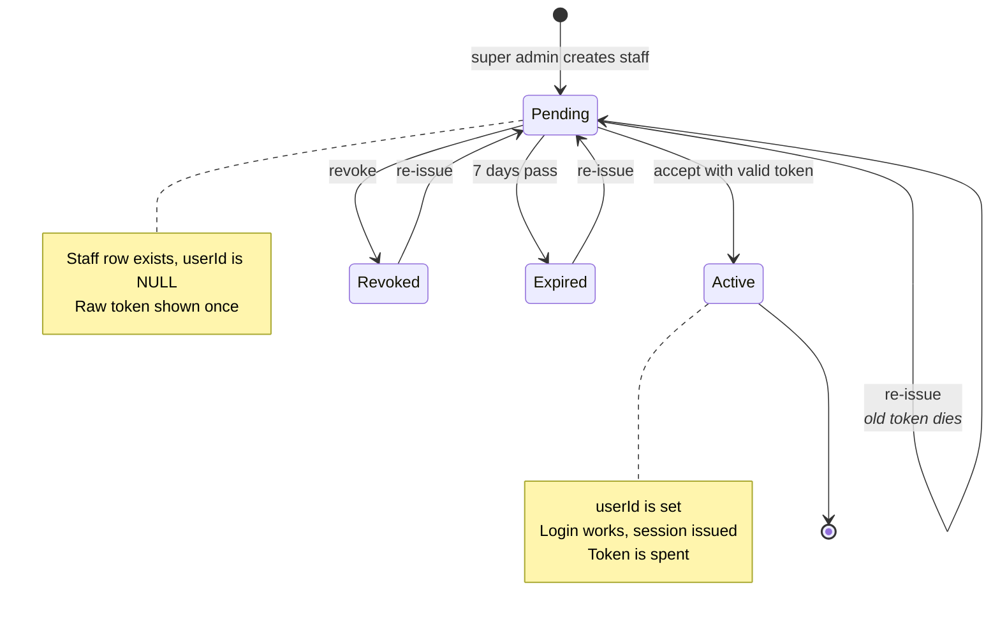

---

## Related decisions

- [ADR-0009](../../apps/api/docs/adr/0009-better-auth-over-workos-and-handrolled.md) — why Better Auth handles the password
- [ADR-0010](../../apps/api/docs/adr/0010-better-auth-boundary-and-identity.md) — why the invite lives in our table and not Better Auth's
- [ADR-0011](../../apps/api/docs/adr/0011-tenant-crossing-403-not-404.md) — why re-issuing across churches gives 404, not 403
- [ADR-0012](../../apps/api/docs/adr/0012-unverified-email-reserves-nothing.md) — why an unverified email reserves nothing, and (amended) why verification changes what's safe

## Deliberately not built

**Accepting with Google.** The invitee has no session, so Better Auth's `/link-social` is unavailable to them — it requires one. Supporting it would mean carrying the invite token through Google's OAuth round trip inside the `state` parameter, which is real complexity in the most security-sensitive path we have.

It is unnecessary, because the journey already works: accept with a password, which gives you a session, then use `POST /api/auth/link-social` to connect Google and sign in with it from then on. One extra step, once, and no new code.

**Self-service linking.** `link-login` is super_admin/delegated-admin-initiated only — a Member cannot link their own existing login to become staff themselves. The admin who already knows this is the right person is the one vouching for the identity; a self-service version would need its own, separate proof of who is asking.

**Relaxing `Staff.userId`'s uniqueness.** A login that is already staff anywhere is refused by `link-login`, even at a different church. Multi-church staff is a real scenario for a denomination with several branches under one login, but it's a separate product question (#36), not solved by loosening this constraint incidentally.
