# Staff invitations

How a super admin adds a colleague to their church, before any email infrastructure exists.

Part of the [architecture map](../architecture.md).

The short version: creating a staff member also mints a **single-use token**. The super admin sees that token exactly once and passes it on by hand, over WhatsApp or in person. Accepting it gives that person a real login and switches their staff record on.

---

## The cast

Five files, each with one job.

| File | Its one job |
|---|---|
| [`staff.controller.ts`](../../apps/api/src/staff/staff.controller.ts) | The front door for super admins. Checks who you are, then delegates. |
| [`staff.service.ts`](../../apps/api/src/staff/staff.service.ts) | Church rules. Creates the staff record, decides pending vs active. |
| [`staff-invite.service.ts`](../../apps/api/src/staff/staff-invite.service.ts) | The token expert. Mints them, hashes them, decides if one is still good. |
| [`accept-invite.controller.ts`](../../apps/api/src/staff/accept-invite.controller.ts) | A separate **public** front door, for the invited person. |
| [`accept-invite.service.ts`](../../apps/api/src/staff/accept-invite.service.ts) | Turns an accepted invite into a real login. |

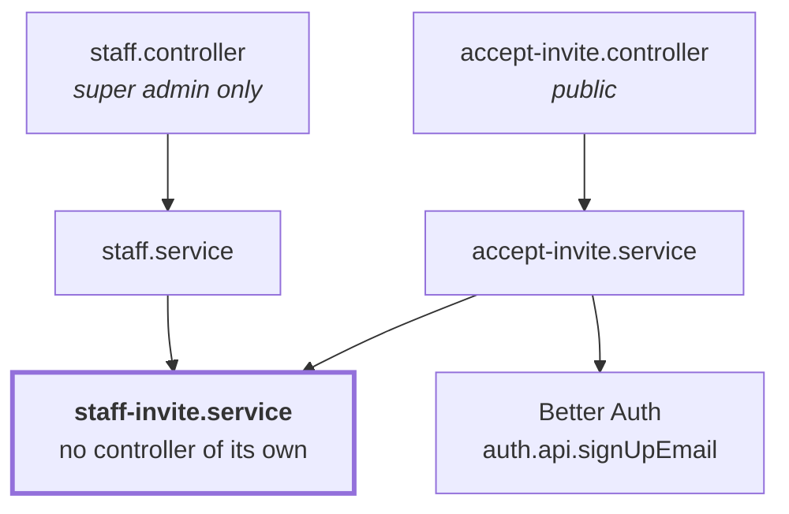

Note that **`staff-invite.service.ts` has no controller.** It never talks to the outside world directly. Both journeys reach it through another service, which is why all the token rules stay in one place.

---

## Journey A: a super admin adds a colleague

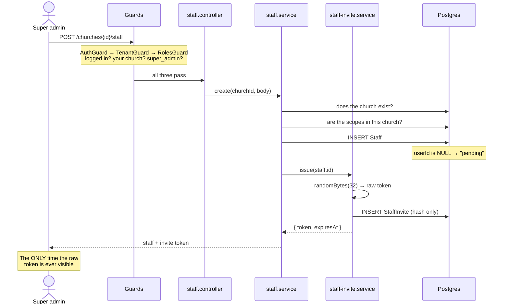

**Step by step, with the code:**

1. The three guards run before any of our code, because they sit on the controller class at [`staff.controller.ts:37-38`](../../apps/api/src/staff/staff.controller.ts). That is why there is no permission check inside `create` itself.
2. `StaffService.create` checks the church exists and the scopes belong to it.
3. The `Staff` row is inserted with **`userId` left empty**. Nothing links this person to a login yet, and filling that gap is what the whole invite system exists to do.
4. `StaffInviteService.issue` mints the token and stores only its hash.
5. The raw token comes back in the response, once.

### Where `status` comes from

`status` is **not stored in the database.** It is worked out fresh on every read, in `withStatus` at [`staff.service.ts:19-22`](../../apps/api/src/staff/staff.service.ts), by asking a single question:

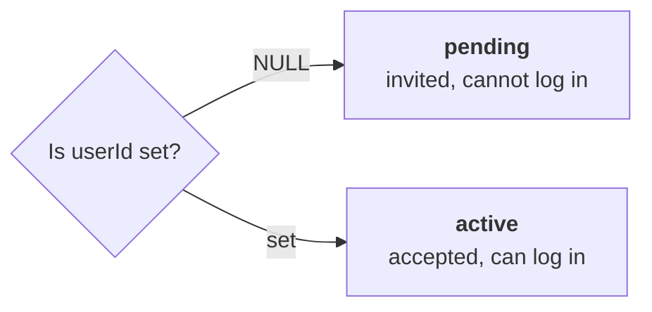

Because it is derived rather than stored, the status can never disagree with reality.

---

## How the token works

The token exists in two different forms, and only one of them is ever written down.

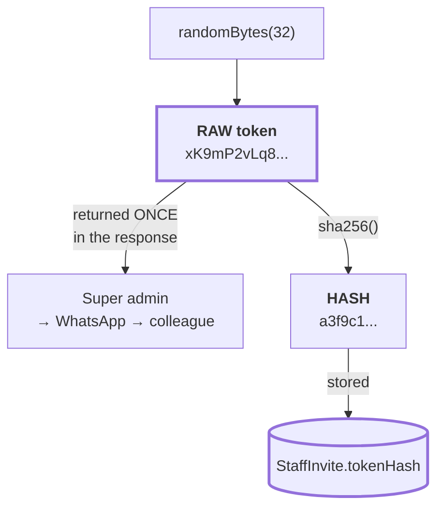

The raw token leaves the server exactly once. Open the `StaffInvite` table and you will find only a hash, which cannot be turned back into the token.

So how is it verified later, if the real thing was never stored? By hashing whatever arrives and looking for a row with that hash:

```ts
// staff-invite.service.ts:47-50
const invite = await this.prisma.staffInvite.findUnique({
  where: { tokenHash: this.hash(rawToken) },
  include: { staff: true },
});
```

A correct token hashes to the stored value and the row is found. A wrong one hashes to something else and the lookup returns nothing. **We never compare the secret ourselves**, which is why there is no string comparison anywhere in that file.

### Why SHA-256 and not bcrypt

For user passwords the answer would be the opposite, so this is worth understanding rather than copying.

Slow hashes like bcrypt exist to protect **low-entropy** secrets. A human password might carry 30 bits of entropy, so an attacker holding the hash can guess their way in, and bcrypt's job is to make each guess expensive.

This token carries **256 bits from a cryptographic random source**. There is nothing to guess. Bcrypt would add real cost to every acceptance and buy nothing. What we still need from SHA-256 is that it is one-way, so a leaked database hands over no usable tokens, and it gives us that.

---

## Journey B: the colleague accepts

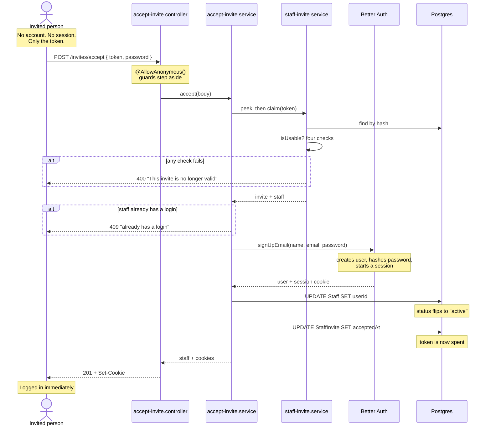

### Why this endpoint is public

Every other church route sits under `/churches/{churchId}/...` behind `TenantGuard`. That guard works by taking your session, finding your staff row, and checking it belongs to the church in the URL.

But this person has **no session and no staff link** — obtaining them is the entire point of accepting. Behind the guard, they would need to already be what the invite is trying to make them. So the route lives at the top level and is marked `@AllowAnonymous()` at [`accept-invite.controller.ts:17`](../../apps/api/src/staff/accept-invite.controller.ts).

**The token is the credential here**, which is exactly what an invite is.

### Why Better Auth creates the login

[`accept-invite.service.ts:20`](../../apps/api/src/staff/accept-invite.service.ts) hands the password to `auth.api.signUpEmail` rather than hashing it ourselves. Password hashing and session creation are precisely what we adopted Better Auth to avoid hand-rolling ([ADR-0009](../../apps/api/docs/adr/0009-better-auth-over-workos-and-handrolled.md)).

`asResponse: true` makes it hand back a full HTTP response including the session cookie, which the controller forwards. That is why accepting logs you straight in, instead of dropping you on a login page to retype the password you chose ten seconds earlier.

---

## When the email is already taken

Because signup is public and unverified, anyone can create a login holding a staff member's email before that person accepts. Left alone, that locks them out permanently, since `signUpEmail` refuses a duplicate.

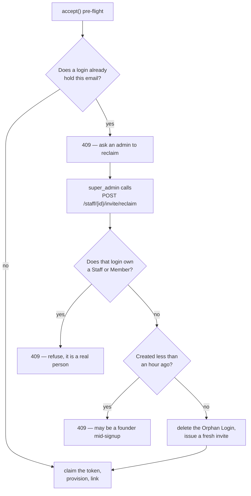

Three guards make deleting someone's login defensible: it must own nothing, it must be older than the grace period, and the caller must be an authenticated super_admin of that church. **Linking the existing login instead would be privilege escalation** — an unverified email proves nothing about who controls it, so that would hand the squatter a finance-role account whose password they chose. See [ADR-0012](../../apps/api/docs/adr/0012-unverified-email-reserves-nothing.md).

## The gatekeeper: one function, four questions

The same four rules decide every rejection, and they are encoded twice in [`staff-invite.service.ts`](../../apps/api/src/staff/staff-invite.service.ts): once in `isUsable`, which the read-only `peek` uses, and once in the `where` clause of `claim`'s conditional `UPDATE`. Those two must stay in step.

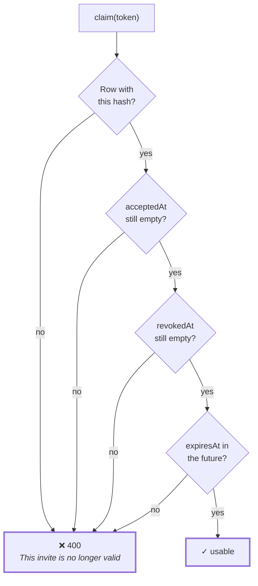

Keeping all four in one place matters. Spread across the accept path, the re-issue path and the revoke path, one of the three would eventually be updated and the others forgotten.

**Every failure returns the same message.** Saying "this invite expired" would confirm to a stranger that the token they guessed was real. Saying the same thing in all four cases gives nothing away.

---

## The four scenarios

### Accepting twice

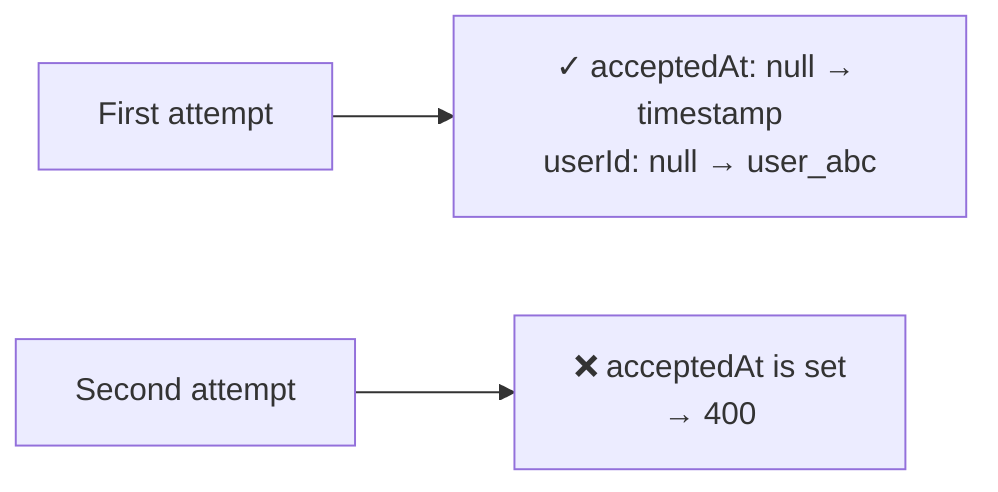

This is what makes the token single-use, and it matters because invites travel over WhatsApp, and WhatsApp messages get forwarded. Once the real person accepts, that message is worthless to anyone else.

Single-use is enforced by the claim itself: one conditional `UPDATE` that sets `acceptedAt` only while it is still null. Two concurrent accepts cannot both win, because the loser blocks on the row lock and then matches nothing. A separate check that the staff member has no login yet runs before the claim, so a burnt token only ever means a genuine fault.

### Re-issuing

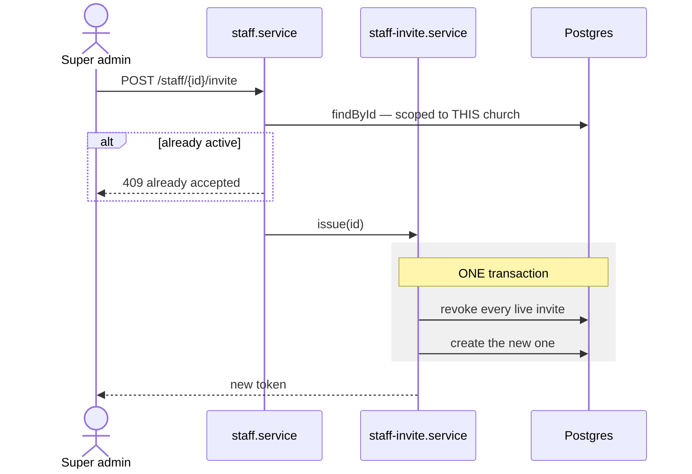

The transaction at [`staff-invite.service.ts:25`](../../apps/api/src/staff/staff-invite.service.ts) is the interesting part. Both statements succeed together or neither happens. If the revoke worked and the create failed, the person would be left with no usable invite and no clue why.

The ordering means **the old token dies the instant a new one is issued**. So if an invite goes to the wrong number, the fix is simply to re-issue.

The `findById` call is doing quiet security work: it scopes the lookup to the church in the URL, so a super admin of one church cannot re-issue invites for another church's staff.

### Revoking

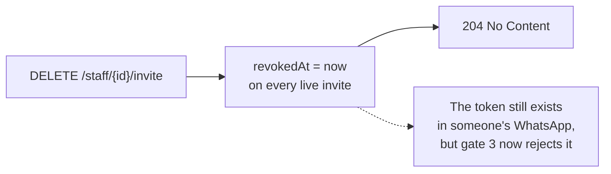

The staff record survives. The person stays in the list as `pending` with no working way in. To remove them entirely, use `DELETE /staff/{id}` instead.

### Expiring

Nobody does anything. One week after it was created, `expiresAt` slips into the past and the fourth gate starts rejecting it.

There is **no cleanup job** deleting old rows, on purpose. When someone asks "why can't Ada log in?", the table answers it: accepted, revoked, or expired.

---

## The whole thing on one page

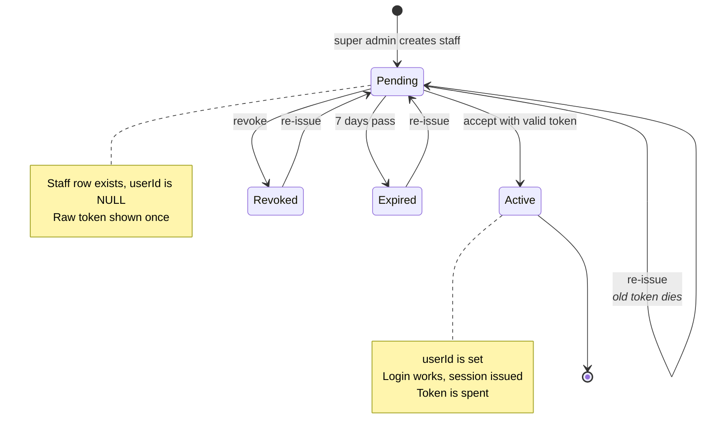

---

## Related decisions

- [ADR-0009](../../apps/api/docs/adr/0009-better-auth-over-workos-and-handrolled.md) — why Better Auth handles the password
- [ADR-0010](../../apps/api/docs/adr/0010-better-auth-boundary-and-identity.md) — why the invite lives in our table and not Better Auth's
- [ADR-0011](../../apps/api/docs/adr/0011-tenant-crossing-403-not-404.md) — why re-issuing across churches gives 404, not 403

## Deliberately not built

**Accepting with Google.** The invitee has no session, so Better Auth's `/link-social` is unavailable to them — it requires one. Supporting it would mean carrying the invite token through Google's OAuth round trip inside the `state` parameter, which is real complexity in the most security-sensitive path we have.

It is unnecessary, because the journey already works: accept with a password, which gives you a session, then use `POST /api/auth/link-social` to connect Google and sign in with it from then on. One extra step, once, and no new code.
