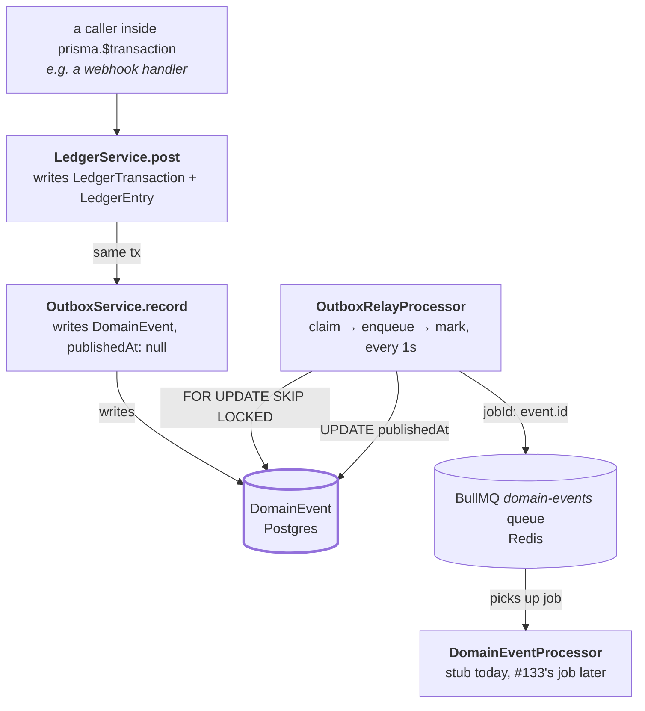
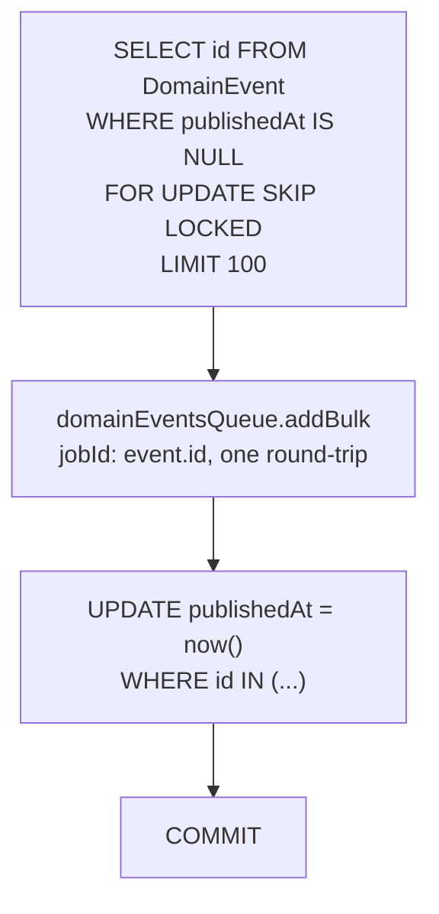

# Transactional outbox and relay

How a money-relevant fact — a settled payment, a refund — reliably becomes an event other parts of
KORU can react to, without ever risking the fact and its event disagreeing about whether the other
one happened.

Part of the [architecture map](../architecture.md).

The short version: `LedgerService.post(tx, ...)` and `OutboxService.record(tx, ...)` share the same
Postgres transaction, so a `LedgerEntry` and its `DomainEvent` commit together or not at all. A
separate worker, `OutboxRelayProcessor`, polls for unpublished `DomainEvent` rows on its own
one-second clock and hands each to a `domain-events` BullMQ queue. Nothing that writes a
`DomainEvent` ever talks to Redis directly, and nothing that reads from Redis ever writes a
`LedgerEntry`.

---

## The cast

| File | Its one job |
|---|---|
| [`ledger.service.ts`](../../apps/api/src/ledger/ledger.service.ts) | The only writer of `LedgerTransaction`/`LedgerEntry` rows. Checks a posting balances to zero, then calls `OutboxService.record` itself, in the same `tx`. |
| [`outbox.service.ts`](../../apps/api/src/events/outbox.service.ts) | Writes one `DomainEvent` row, `publishedAt: null`. Always called with the transaction its caller already has open — never opens its own. |
| [`outbox-relay.processor.ts`](../../apps/api/src/events/outbox-relay.processor.ts) | The worker. Claims unpublished rows, enqueues one job per event, marks them published — in that order, inside its own transaction. |
| [`domain-event.processor.ts`](../../apps/api/src/events/domain-event.processor.ts) | Consumes the `domain-events` queue. A deliberate stub today — logs and returns; #133 replaces the body with real dispatch. |
| [`events.module.ts`](../../apps/api/src/events/events.module.ts) | Wires the two services and two processors together, and registers the relay's recurring schedule on boot. |
| [`queue.module.ts`](../../apps/api/src/queue/queue.module.ts) | Registers the `outbox-relay` and `domain-events` queues alongside the existing `email` queue. |
| `DomainEvent` (Prisma model) | The durable handoff point. `publishedAt: null` means "not yet relayed"; once set, the relay never looks at that row again. |
| [`domain-events.ts`](../../packages/shared/src/domain-events.ts) | A Zod discriminated union for `DomainEvent.payload`, one variant per event type. IDs and amounts only — never names, phone numbers, or emails. |

`DomainEvent` sits at the center on purpose, the same way `EmailLog` does in the email queue design
— see [Email queue and delivery logging](./email-queue-and-logging.md) for that precedent. The
difference here is *how* the row gets there: `EmailLog` is written and enqueued as two separate
calls with an acknowledged gap between them; `DomainEvent` is written inside the same transaction
as the fact it describes, closing that gap for the write side entirely.

---

## Why the ledger write and the event write share one transaction

The email queue's own docs are explicit about a gap it accepts: `MailService.send` writes a row,
then enqueues a job, and a crash between those two calls leaves a row with no job ever created for
it. That gap is tolerable for a notification email. It is not tolerable for a `LedgerEntry` — a
posted debit with no corresponding event would mean money moved and nothing downstream (a
projection, a receipt, a future consumer) ever finds out.

`LedgerService.post(tx, input)` closes this by construction, not convention: `OutboxService.record`
is called with the *same* `Prisma.TransactionClient` that just wrote the ledger rows, never a fresh
connection. Both writer methods are typed to accept only `Prisma.TransactionClient`, never
`PrismaService` — but TypeScript's structural typing does not actually close this on its own, since
`PrismaService extends PrismaClient` is structurally assignable to `Prisma.TransactionClient`
anyway. `assertTransactionClient` (`apps/api/src/prisma/assert-transaction-client.ts`) is the real
enforcement: confirmed against this exact Prisma 7 + `@prisma/adapter-pg` setup that the object a
`prisma.$transaction` callback receives genuinely lacks `$connect` at runtime, even though it still
carries `$transaction` itself (the type's own claim to the contrary). `$connect` is the reliable
discriminator, and both writer methods assert on it before doing anything else.

**`LedgerService.post` also checks that every `campaignId`/`branchId` on an entry actually belongs
to the posting `churchId`.** ADR-0018 denormalizes `churchId` onto every money table for
tenant-scoped indexing, but nothing about that denormalization is enforced by the database itself —
a caller could pass a `campaignId` belonging to a different church, and the row would land looking
valid while silently corrupting both churches' totals. `post()` is the one place this check can
live, per ADR-0018's own stated intent to add it "once real write paths exist." A mismatch throws
`BadRequestException` before any row is written.

`OutboxService.record` also parses `input.payload` through `DomainEventPayloadSchema` before
writing it, per ADR-0005 — the Zod schema is the single source of truth, not just a compile-time
type. A payload that fails validation (a non-UUID id, a negative amount) is rejected at the write
site, not discovered later by a consumer that trusted a `Json` column unconditionally.

---

## Claim, enqueue, mark — and why that order

`OutboxRelayProcessor.relay()` runs every second (via BullMQ's `upsertJobScheduler`, registered on
boot in `EventsModule.onModuleInit`, gated by `isRelayScheduleEnabled()` in `config/env.ts` — only
the e2e suite sets `RELAY_SCHEDULE_ENABLED=false`, so tests can call `relay()` directly instead of
racing a real background tick; production always registers it) and does three things inside one
more `prisma.$transaction`:

**`FOR UPDATE SKIP LOCKED`** lets multiple API replicas run their relay tick at the same moment
without coordinating: `FOR UPDATE` locks whatever rows this transaction claims, and `SKIP LOCKED`
makes a concurrent claim skip rows another replica already locked instead of blocking on them. A
same-outcome test (every row claimed exactly once) cannot actually distinguish this from a plain
`FOR UPDATE` that blocks and then finds nothing left — both produce the same end state for a small
batch. The real property — a second claim does not wait for the first transaction's lock — is
proven with a timing bound: seed a row, hold one transaction open on it with `pg_sleep`, and assert
a concurrent claim returns in a fraction of that hold time. See "FOR UPDATE SKIP LOCKED lets a
concurrent claim proceed without waiting" in
[`outbox.e2e-spec.ts`](../../apps/api/test/outbox.e2e-spec.ts) — verified directly against this
exact Prisma 7 + `@prisma/adapter-pg` combination, not assumed from Postgres's documentation alone.
The claim query is served by `DomainEvent`'s `@@index([publishedAt, createdAt])` — a full index,
not a partial one. An earlier version of this migration used a raw-SQL partial index
(`WHERE "publishedAt" IS NULL`) that `schema.prisma` had no syntax to declare, which meant a future
`prisma migrate dev` could compute it as drift and silently drop it. Migration
`20260805140000_ledger_dedupe_per_church_and_domain_event_index` replaced it with a full index
`schema.prisma` can track, at the cost of the index covering some already-published rows it will
never be asked about.

**`addBulk`, not a loop of individual `add()` calls.** A claimed batch can be up to 100 rows, and
this whole sequence runs inside one Postgres transaction holding real row locks. A sequential loop
of 100 `await queue.add(...)` calls is 100 separate Redis round-trips inside that transaction's
timeout window — under any real network latency to Redis, that risks the transaction timing out
with the jobs already enqueued but the rows never marked published, which would re-relay the same
batch forever. `addBulk` sends the whole batch in one round-trip; the transaction also sets an
explicit `timeout` rather than relying on Prisma's 5-second default.

**Enqueue happens before the row is marked published, never after.** If the process crashes between
those two steps, the row is still `publishedAt: null`, and the next tick relays it again — a
possible duplicate, never a loss. Marking first and enqueueing second would risk the opposite: a
crash in between leaves a row that says "published" with no job ever in Redis, and no durable trace
anywhere that it still needed to go out. A duplicate is recoverable by a future idempotent consumer
(#133); a silent loss is not recoverable by anything.

**`jobId: event.id`** narrows, but does not close, the reverse risk — a crash between the enqueue
succeeding and the mark committing, which re-relays an already-enqueued event. While the original
job still exists somewhere in Redis (waiting, active, or recently completed, before BullMQ evicts
it), a second `add()` with the same `jobId` is a silent no-op. Once that job has been evicted, the
guard has nothing left to compare against, and a genuine duplicate reaches the queue. This is a real
narrowing of the window, not a closed one — see "Deliberately not built" below.

---

## The health check

`GET /health/outbox`, alongside the existing health endpoints, reports the unpublished count, the
`domain-events` queue's depth and failed-job count, and the `outbox-relay` queue's own failed count
— the same "is this actually stuck, not just busy" signal `GET /health/redis` gives for the email
queue, feeding into #90's observability work. The relay's own failed count matters on its own: its
tick has `attempts: 1` (see the next section), so a relay that starts failing every tick dead-letters
immediately and would otherwise show up nowhere except a slowly rising `unpublishedCount`.

---

## Related decisions

- [ADR-0016](../../apps/api/docs/adr/0016-double-entry-ledger-source-of-truth.md) — the ledger as
  source of truth, and why the transactional outbox is named there as a companion decision this
  design fulfills.
- [ADR-0017](../../apps/api/docs/adr/0017-donation-intent-payment-attempt-split.md) — the
  intent/attempt/payment split that `LedgerService.post` gets called from, once #107 builds the
  caller.
- [ADR-0018](../../apps/api/docs/adr/0018-denormalized-tenancy-on-money-tables.md) — why every
  money table denormalizes `churchId`, and the "worth having once real write paths exist"
  consistency check that `LedgerService.post` now runs for `campaignId`/`branchId`.

## Deliberately not built

**"No event is ever double-published."** Not a guarantee this design, or any transactional-outbox
design without two-phase commit spanning Postgres and Redis, can make. What it guarantees instead:
a crash anywhere in the claim/enqueue/mark sequence produces at most a duplicate, never a loss. Full
"processed exactly once" *effect* requires idempotent consumers — that is #133's job, not this
ticket's.

**The consumer dispatch loop itself.** `DomainEventProcessor` exists today purely so the
`domain-events` queue has *some* registered consumer and nothing piles up unprocessed while this
ticket is being tested. #133 replaces its body with real per-event-type handlers and a
`DomainEventDelivery` record, so a re-delivered job is recognized and skipped rather than
double-processed.

**A queue dashboard, and a second relay schedule.** Same reasoning as the email queue's own
"deliberately not built" section — not needed at this volume, and a future recurring job type
should reuse `QueueModule`'s existing Redis connection rather than stand up a new one.
