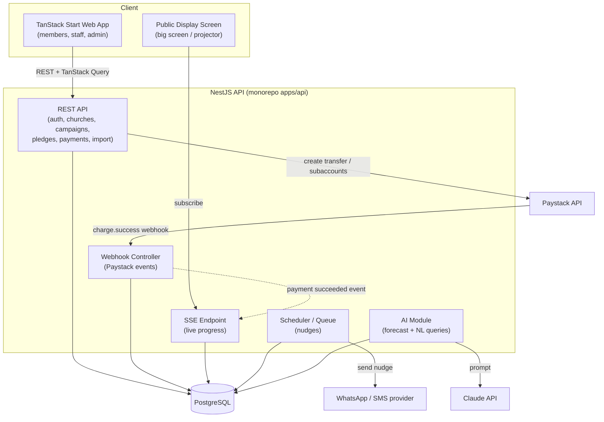
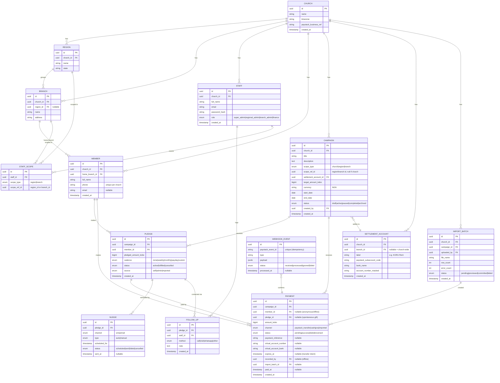
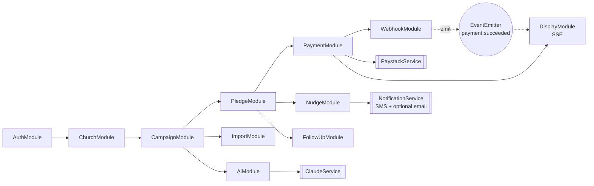
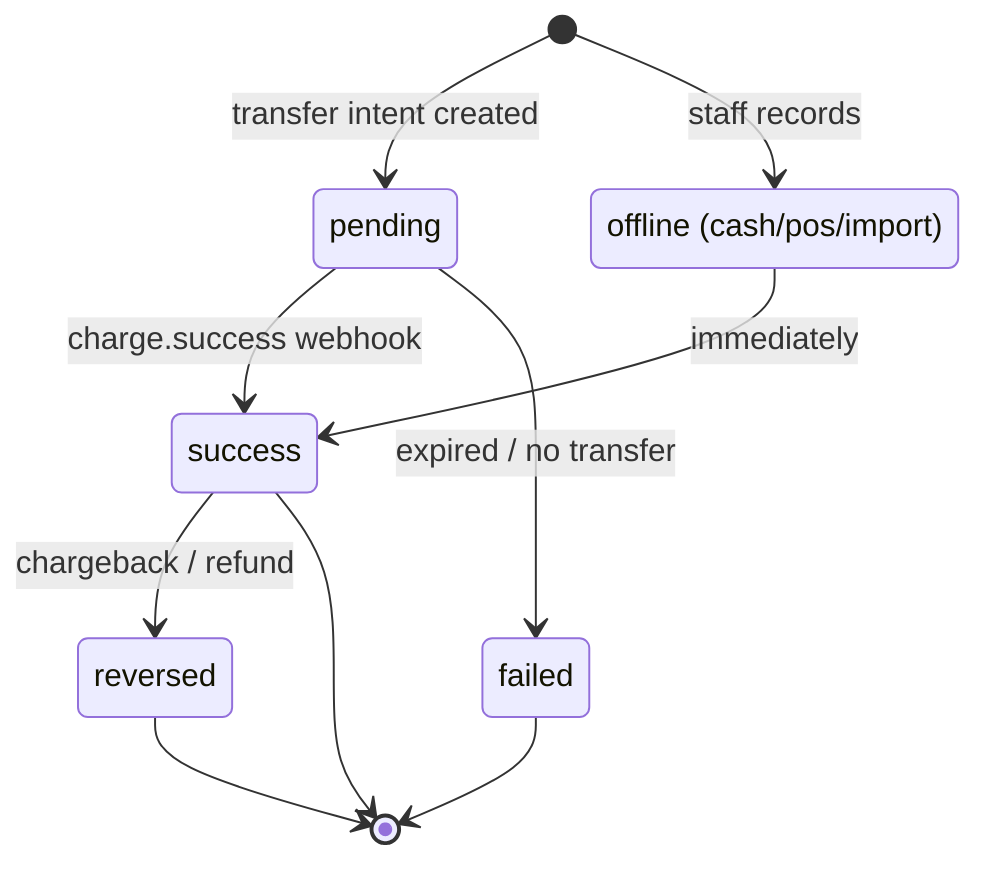
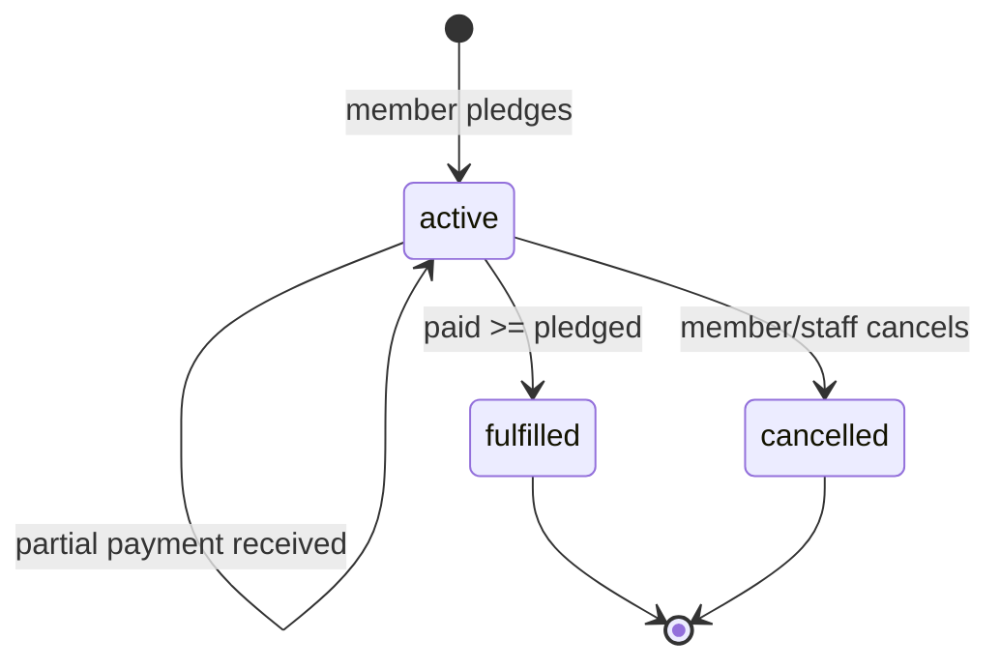

# KORU — Domain Model & System Architecture

**Date:** 2026-07-10
**Status:** For review (to be locked before any code)
**Companion to:** `2026-07-10-koru-design.md`

This document locks down: the **ubiquitous language**, **user stories** (PM lens), the **system
architecture**, the **database schema**, **backend communication**, and the **payment state
machine** (architect lens). Diagrams are Mermaid (render on GitHub / most Markdown viewers).

---

## 1. Ubiquitous Language (glossary)

Getting these words right now prevents confusion in code later. Everyone (and every table)
uses these exact terms.

| Term | Meaning |
|---|---|
| **Church** | The top-level organisation and the **tenant** boundary. e.g. Celebration Church. |
| **Region** | A grouping of branches, usually a state. e.g. "Abuja (FCT)". |
| **Branch** | A single physical congregation. e.g. KORU Abuja. |
| **Member** | A person who gives. Identified by **phone number**. **No login.** |
| **Staff / Admin** | A church worker who manages KORU. **Has a login.** Has a role + scope. |
| **Campaign** | A fundraising effort with a target amount, scoped church/region/branch. e.g. "KORU Rent 2026". |
| **Pledge** | A member's *promise* to give an amount to a campaign. A commitment, not money yet. |
| **Payment** (Contribution) | Actual money received toward a campaign — via Paystack transfer, cash, POS, or import. |
| **Settlement Account** | A church's real bank account, registered as a Paystack **subaccount**, where a campaign's money settles. |
| **Nudge** | An automated, system-sent reminder to a member about a pledge. |
| **Follow-up** | A *manual*, human contact (call/visit) logged by staff. |
| **Fulfilment** | When a pledge's paid amount ≥ pledged amount. |

> **Money rule:** all amounts are stored as **integers in kobo** (₦1 = 100 kobo). Never floats.
> This avoids rounding errors in financial totals.

---

## 2. User Stories (Product Manager lens)

Grouped by role. `[MVP]` vs `[Later]` tagged.

### Epic A — Member (the giver)
- `[MVP]` As a member, I can **scan a QR code or tap a link** and see the campaign and its progress, so I can give in seconds.
- `[MVP]` As a member, I can **make a pledge** (promise an amount) to a campaign using just my name + phone number, without creating an account.
- `[MVP]` As a member, I can **pay by bank transfer** to a generated account number, and see my payment reflected automatically, so I never have to prove I paid.
- `[MVP]` As a member, I can **give without a formal pledge** (spontaneous gift) to a campaign.
- `[MVP]` As a member, I can **choose my own reminder rhythm** when I pledge (e.g. monthly, on payday).
- `[Later]` As a member, I can **verify my phone with an OTP** to see all my pledges across campaigns in one place.

### Epic B — Finance / Welfare team
- `[MVP]` As finance staff, I can **create a campaign**, set its target, dates, scope (church/region/branch), and settlement account.
- `[MVP]` As finance staff, I can **see all pledges and payments** for my scope, with who has paid, partially paid, or not started.
- `[MVP]` As finance staff, I can **record an offline payment** (cash/POS) against a member's pledge.
- `[MVP]` As finance staff, I can **import a CSV/Excel** of existing members and pledges, mapping their columns to KORU fields, with a preview before committing.
- `[MVP]` As finance staff, I can **log a manual follow-up** (call/visit) so there's a record and we don't double-chase.
- `[MVP]` As finance staff, I can **ask questions in plain English** ("who pledged for the bus but hasn't paid?") and get an answer.

### Epic C — Leadership / Pastor
- `[MVP]` As a pastor, I can **display a live progress screen** (amount raised / target / % / giver count + QR) for the congregation — no individual names.
- `[MVP]` As leadership, I can **see a forecast** ("at current rate, ₦18M of ₦25M by December") and which campaigns are stalling.

### Epic D — Church Admin (setup)
- `[MVP]` As a super-admin, I can **set up the church hierarchy** (regions, branches) and **invite staff** with roles + scope.
- `[MVP]` As a super-admin, I can **connect Paystack** and map each branch/purpose bank account as a settlement subaccount.

### Epic E — Platform (cross-cutting)
- `[MVP]` As the system, I **receive Paystack webhooks, verify + de-duplicate them**, and update campaign progress idempotently.
- `[MVP]` As the system, I **send scheduled nudges** via WhatsApp/SMS based on each member's chosen rhythm.

---

## 3. System Architecture (container view)



**Key flows:**
- Frontend talks to NestJS over REST (TanStack Query for caching/refetch).
- The **public display** subscribes to an **SSE** stream; when a payment succeeds, the webhook
  handler emits an internal event → SSE pushes the new aggregate → the bar moves live.
- Paystack is called **outbound** (create subaccounts, create transfer transactions) and calls us
  **inbound** (webhooks).

---

## 4. Database Schema (ERD)



### Schema notes & decisions

1. **`PAYMENT` is the single source of truth for money.** Campaign progress = `SUM(amount_kobo)
   WHERE campaign_id = ? AND status = 'success'`. Giver count = `COUNT(DISTINCT member_id)` of
   successful payments. We do **not** store a mutable `amount_raised` on the campaign (derive it,
   or cache it via a trigger/materialised view later if needed).
2. **A Payment can exist without a Pledge** (`pledge_id` nullable) — spontaneous gifts.
3. **A Pledge's paid amount is derived** = `SUM` of its successful payments. Fulfilment is
   computed, then the pledge `status` is flipped to `fulfilled`.
4. **`WEBHOOK_EVENT` gives idempotency** — Paystack may deliver the same event twice; we dedupe
   on `paystack_event_id` before touching a Payment.
5. **Tenant isolation:** every table carries (directly or transitively) a `church_id`. Every query
   is scoped by the caller's church. (Enforced in the API layer; Postgres Row-Level Security is a
   later hardening option.)
6. **Multi-currency-ready but single-currency now:** `currency` exists on Campaign so the
   international-branch future doesn't require a painful migration.

---

## 5. Backend Communication (NestJS modules)

NestJS is modular; most communication is **in-process** (a service injects another service).
External communication is only with Paystack, the messaging provider, and Claude.



- **Decoupling via events:** when a payment succeeds (webhook or offline record), the Payment
  service emits an in-process `payment.succeeded` event. The **DisplayModule** listens and pushes
  the new aggregate to SSE subscribers. This keeps the payment path from knowing about screens.
- **Nudges** run on a scheduler (`@nestjs/schedule` for MVP; a proper queue like BullMQ if volume
  grows). It reads pledges due for a reminder and calls `NotificationService`.
- **Shared types:** request/response DTOs and their **Zod schemas** live in `packages/shared`,
  imported by both `apps/api` and `apps/web` — one definition, no drift.

---

## 6. Payment Lifecycle (sequence)

The critical path — pay-with-transfer with automatic reconciliation:

```mermaid
sequenceDiagram
    actor M as Member
    participant W as Web App
    participant API as NestJS API
    participant PS as Paystack
    participant WH as Webhook Controller
    participant D as Display (SSE)

    M->>W: Scan QR / tap link, choose amount
    W->>API: POST /campaigns/:id/pay {amount, phone}
    API->>PS: Create transfer transaction (metadata: member, campaign, subaccount)
    PS-->>API: Virtual account number + reference
    API->>API: Create PAYMENT (status=pending, expires_at)
    API-->>W: Show account number + amount
    W-->>M: "Transfer ₦X to 1234567890 (Wema)"
    M->>PS: Bank transfer from their bank app
    PS->>WH: POST webhook charge.success (signed)
    WH->>WH: Verify signature + dedupe (WEBHOOK_EVENT)
    WH->>API: Mark PAYMENT success, set paid_at
    API->>API: Recompute campaign total; flip pledge to fulfilled if met
    API-->>D: emit payment.succeeded
    D-->>M: (big screen bar moves live)
```

**Failure/edge handling:**
- **No transfer before `expires_at`** → a cleanup job marks the pending Payment `failed` (or
  `expired`); no effect on totals.
- **Duplicate webhook** → dropped at the dedupe step.
- **Reversal/chargeback** (`charge.reversed` style event) → Payment set `reversed`; excluded from
  totals automatically because totals only count `success`.
- **Offline (cash/POS)** → staff records a Payment directly with `status=success`, `channel=cash`,
  which emits the same `payment.succeeded` event → same downstream behaviour.

---

## 7. State Machines

### Payment



Only `success` payments count toward campaign totals and pledge fulfilment.

### Pledge



`overdue` is **not** a stored state — it's a derived flag (`active AND now > campaign.end_date`)
used for nudge prioritisation and dashboards, so we never have to run a job just to "expire" pledges.

---

## 8. Locked decisions

Reviewed and confirmed 2026-07-10:

1. **Member ↔ branch:** each member has **exactly one home branch**. Cross-branch giving works
   because a Payment records its own campaign/branch — no join table needed.
2. **Anonymous giving:** **allowed.** `member_id` on `PAYMENT` is nullable; a gift can be made
   with no identity. It counts toward the total but can't be nudged or attributed.
3. **Staff scope:** **multiple scopes** per staff — via the **`STAFF_SCOPE`** join table
   (a staff member can cover several branches/regions). Super-admin covers the whole church.
4. **Nudge channels:** **SMS + email at launch** (member can receive both; **email optional**).
   **No WhatsApp** (not everyone uses it). `NUDGE.channel` = `sms|email`; NotificationService
   integrates an SMS gateway (e.g. Termii) and an email provider.

Also locked: ubiquitous language, entity set, campaign scoping model, payment-as-source-of-truth,
webhook idempotency, kobo-integer money, event-driven SSE.
```
